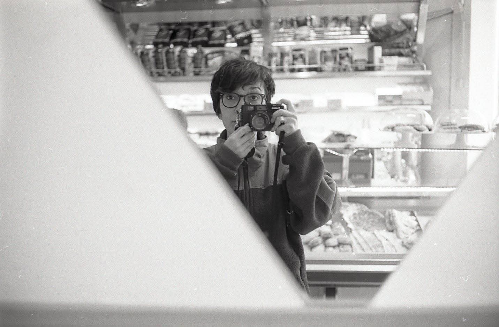

# About me

Berlin, Germany - 2018

<h4 style="margin:0">Multidisciplinary Product Designer</h4>

Exploring tech, design, and nature

I am a multidisciplinary Product Designer who blends creativity, analytical thinking and curiosity to solve complex problems.

<ul>
    <li>I move easily between <strong>design and code</strong>, having a more thoughful crafting process.</li>
    <li>I enjoy working in <strong>collaborative, high performing</strong> product teams where ideas can evolve.</li>
    <li>I am a <strong>curious mind</strong> who is always expanding her technical knowledge.</li>
</ul>

🌿 I also enjoy draw and write on paper, collect analog snapshots from my travels and stay active through sport and movement.

      

            <a class="btn-connect circled" href="https://www.linkedin.com/in/veronicadeleonh/" target=_blank></a>
            <a class="btn-connect circled" href="https://github.com/veronicadeleonh" target=_blank></a>
            <a class="btn-connect circled" href="https://instagram.com/veronicadeleonh" target=_blank></a>
      

      <a class="btn-connect rounded arrow" href="images/vdlh-cv.pdf">Download CV</a>
      <!--   -->

Tarifa, Spain - 2024

#### Tiny Data Adventures

Lately I’ve been exploring how design and data can come together in small, playful projects. Here are a few I’ve built in the past year:

    

        <a href="https://github.com/veronicadeleonh/earthquakes-volcanoes" target="_blank">
            
<strong>🌋 Volcano & Earthquake Dashboard</strong>

        </a>
        

            
Python

            
Pandas

            
Streamlit

            
Folium

            
Plotly

        

        
An interactive dashboard that visualizes seismic and volcanic activity worldwide. It combines real-time data with historical trends to explore patterns aroud the globe.

     

    

        <a href="hhttps://github.com/veronicadeleonh/solo-traveler-survey" target="_blank">
            
<strong>🎒 Solo Traveler Survey</strong>

        </a>
        

            
Python

            
Pandas

            
Flask

            
TailwindCSS

            
Chart.js

        

        
A data-driven look into why people travel alone. This dashboard uncovers insights across age groups and regions after collecting user's data thourgh a survey.

     

    

        <a href="https://github.com/veronicadeleonh/travel-wishes-bot" target="_blank">
            
<strong>🗺️ TravelWishesBot</strong>

        </a>
        

            
Python

            
Telegram API

            
Notion API

            
OpenAI

            
Tavily API

        

        
A conversational travel assistant that helps users explore destinations, discover travel tips via real-time search, and save favorites to Notion.

     

#### Film x Frontend

I designed and built a website to showcase the best analog photographs from my travels. This passion project came to life with modern front-end tools like ReactJS, TailwindCSS, Contentful, and Vercel.

    
    

<strong>Want to see more of my analog pics?</strong> Check out my analog web

    <a class="btn-connect rounded btn-white arrow" href="https://analog.veronicadeleonh.de">Let's go! </a>
    

#### Tools I use

A snapshot of the design, code, and data tools in my toolkit.

    

        

            
        

        
Figma

    
  
    

            

                
            

            
Notion

    

        

            

                
            

            
Webflow

    
       

    

            

                
            

            
HTML

    

        

            

                
            

            
CSS

    

    

        

            
        

        
Javascript

    
         

    

        

            
        

        
VSCode

    
  
    

            

                
            

            
ReactJS

    

        

            

                
            

            
TailwindCSS

    
       

    

        

            
        

        
Python

    
  
    

            

                
            

            
Pandas

    

        

            

                
            

            
MySQL

    
       

    

            

                
            

            
ChatGPT

    

    

        

            
        

        
Claude

    
  
        

            

                
            

            
Cursor

    
       

#### Work Experience

    

        

            
        

        

        <a href="https://mondly.com/" target="_blank">
            
Mondly

        </a>
            
Growth & Senior Product Designer

        

    

    

        2023 - 2024
    

    

        

            
        

        

        <a href="https://eyeem.com" target="_blank">
            
EyeEm

        </a>
            
Product Designer

        

    

    

        2021 - 2023
    

    

        

            
        

        

        <a href="https://basecase.com/" target="_blank">
            
BaseCase

        </a>
            
Marketing & UX/UI Designer

        

    

    

        2017 - 2020
    

#### Education

    

    <a href="https://www.ironhack.com/" target="_blank">
        
Bootcamp - Data Analytics

    </a>
        
Ironhack Berlin 

    

    

        2024 - 2025
    

    

    <a href="https://www.ironhack.com/" target="_blank">
        
Bootcamp - Full-Stack Web Development

    </a>
        
Ironhack Berlin 

    

    

        2020
    

    

    <a href="https://www.adbk.de/" target="_blank">
        

            Erasmus - Fotografie und Neuen Medien

    </a>
        
Akademie der Bildenden Künste München 

    

    

        2010 - 2011
    

    

    <a href="https://abaroma.it/" target="_blank">
        
Diploma - Grafica Editoriale

    </a>
        
Accademia di Belle Arti di Roma 

    

    

        2008 - 2011
    

#### Languages

    

        
Spanish 

    

    

        

            Native
        

        

                
                
                
                
                
            

    

    

        
English 

    

    

        

            Proficient
        

        

            
            
            
            
            
        

    

    

        
Italian 

    

    

        

            Proficient
        

        

            
            
            
            
            
        

    

    

        
German 

    

    

        

            Upper intermediate
        

        

            
            
            
            
            
        

    

    

        
Portuguese 

    

    

        

            Beginner
        

        

            
            
            
            
            
        

    

#### A bit about my path

I grew up on a small Caribbean island, fascinated by computers, creativity, and crafts. That curiosity guided me toward design, code, and systems thinking — eventually shaping my path into Product Design.

- My curiosity led me to explore design, code, and visual storytelling — starting with Dreamweaver and Flash courses way back 😅.

- I studied **Editorial Design** in Italy, with an ERASMUS year at **ADBK Munich** that sparked my passion for photography and connected me with the art world.

- After freelancing and co-founding a GbR, I moved to Berlin and joined **BaseCase**, where I transitioned from marketing design into **UX/UI** on a SaaS software team.

- I later designed for **EyeEm** and **Mondly (Pearson)**, collaborating with cross-functional teams on global products in photography, language learning, and growth.

- Along the way, I completed bootcamps in **Full-Stack Web Development** and **Data Analytics** — blending design with code and data has become where I thrive.

- I keep building tools for fun: often driven by curiosity and a love for learning.

