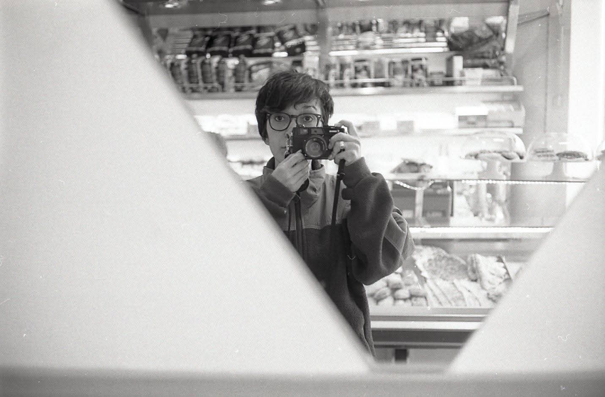
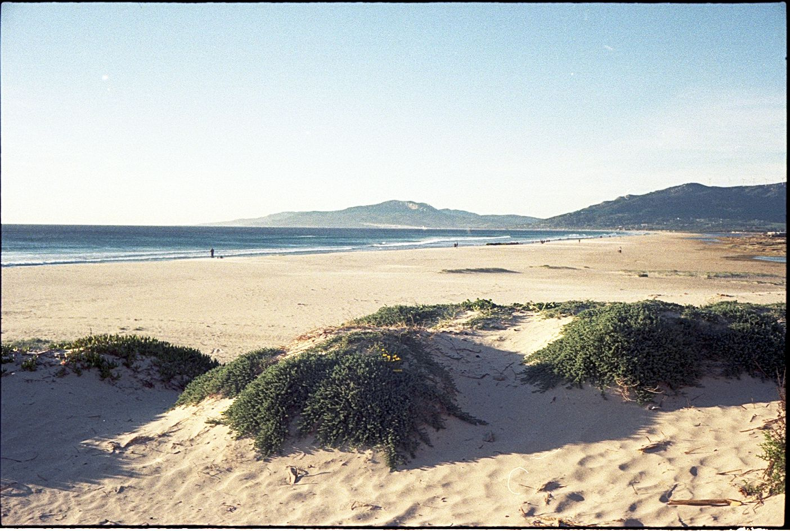
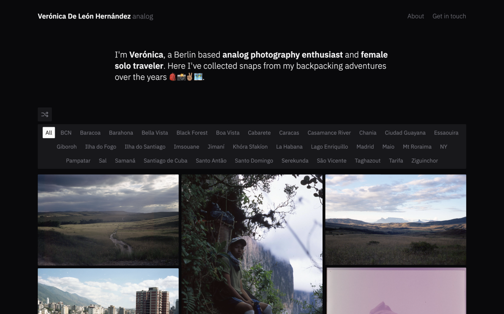

# About me

Berlin, Germany - 2018

<h4 style="margin:0">Product Designer exploring systems, visuals and code</h4>

Exploring thoughtful digital experiences through curiosity, systems and experimentation

Over the past few years, I’ve been exploring how coding can expand the way I design, prototype and solve problems. This curiosity has led me to build projects around geospatial data, climate exploration, frontend experiments and design systems.

I enjoy moving between design and code, using both as tools to explore ideas, systems and visual storytelling.

🌿 Outside of work, I draw and write on paper, collect analog snapshots from my travels and stay active through sport and movement.

      

            <a class="btn-connect circled" href="https://www.linkedin.com/in/veronicadeleonh/" target=_blank></a>
            <a class="btn-connect circled" href="https://github.com/veronicadeleonh" target=_blank></a>
            <a class="btn-connect circled" href="https://instagram.com/veronicadeleonh" target=_blank></a>
      

      <a class="btn-connect rounded arrow" href="images/vdlh-cv.pdf">Download CV</a>
      <!--   -->

Tarifa, Spain - 2024

#### Tiny Data Adventures

A growing collection of projects shaped by curiosity for data, systems, geography and visual exploration.

    

        <a href="https://github.com/veronicadeleonh/earthquakes-volcanoes" target="_blank">
            
<strong>🌋 Volcano & Earthquake Dashboard</strong>

        </a>
        

            
Python

            
Pandas

            
Streamlit

            
Folium

            
Plotly

        

        
Exploring seismic and volcanic activity through real-time geospatial visualization and interactive mapping. The dashboard combines live earthquake data, volcanic eruptions and tectonic plate layers to uncover patterns across the globe.

     

    

        <a href="https://volcano-explorer-iota.vercel.app/" target="_blank">
            
<strong>🌋 Volcano Explorer</strong>

        </a>
        

            
Vibecode

            
Python

            
Streamlit

            
Geospatial Data

        

        
A visual exploration of volcanoes around the world, built from a long-standing curiosity for natural systems and Earth science. The project experiments with geospatial interfaces, mapping and data storytelling.

     

    

        <a href="https://coral-bleaching-model.vercel.app/" target="_blank">
            
<strong>🪸 Coral Bleaching Monitor</strong>

        </a>
        

            
Vibecode

            
Python

            
Data Visualization

            
Climate Data

        

        
An exploratory project focused on coral bleaching and climate-related datasets. Built as a way to better understand environmental patterns through visualization, interaction and data exploration.

     

    

        <a href="https://github.com/veronicadeleonh/mathwave" target="_blank">
            
<strong>〜 MathWave</strong>

        </a>
        

            
Vibecode

            
HTML

            
Canvas

            
Web Audio API

            
Creative Coding

        

        
A browser-based audio playground where mathematical functions become melodies. Built as a single HTML file using Canvas and the Web Audio API, exploring the relationship between curves, sound and interaction.

     

#### Film x Frontend

An analog photography project built from years of collecting quiet moments, landscapes and visual fragments during my travels.

Designed and developed using React, TailwindCSS, Contentful and Vercel.

    
    

<strong>Want to explore more from the analog archive?</strong> Check out my analog web

    <a class="btn-connect rounded btn-white arrow" href="https://analog.veronicadeleonh.de">Let's go! </a>
    

#### Tools I use

A mix of design, frontend, data and AI tools I use across projects and experiments.

    

        

        
Figma

    

    

        

        
HTML/CSS

    

    

        

        
Javascript

    

    

        

        
ReactJS

    

    

        

        
Python

    

    

        

        
MySQL

    

    

        

        
ChatGPT

    

    

        

        
Claude Code

    

#### Work Experience

    

        

            
        

        

        <a href="https://mondly.com/" target="_blank">
            
Mondly

        </a>
            
Growth & Senior Product Designer

        

    

    

        2023 - 2024
    

    

        

            
        

        

        <a href="https://eyeem.com" target="_blank">
            
EyeEm

        </a>
            
Product Designer

        

    

    

        2021 - 2023
    

    

        

            
        

        

        <a href="https://basecase.com/" target="_blank">
            
BaseCase

        </a>
            
Marketing & UX/UI Designer

        

    

    

        2017 - 2020
    

#### Education

    

    <a href="https://www.ironhack.com/" target="_blank">
        
Bootcamp - Data Analytics

    </a>
        
Ironhack Berlin 

    

    

        2024 - 2025
    

    

    <a href="https://www.ironhack.com/" target="_blank">
        
Bootcamp - Full-Stack Web Development

    </a>
        
Ironhack Berlin 

    

    

        2020
    

    

    <a href="https://www.adbk.de/" target="_blank">
        

            Erasmus - Fotografie und Neuen Medien

    </a>
        
Akademie der Bildenden Künste München 

    

    

        2010 - 2011
    

    

    <a href="https://abaroma.it/" target="_blank">
        
Diploma - Grafica Editoriale

    </a>
        
Accademia di Belle Arti di Roma 

    

    

        2008 - 2011
    

#### Languages

    

        
Spanish 

    

    

        

            Native
        

        

                
                
                
                
                
            

    

    

        
English 

    

    

        

            Proficient
        

        

            
            
            
            
            
        

    

    

        
Italian 

    

    

        

            Proficient
        

        

            
            
            
            
            
        

    

    

        
German 

    

    

        

            Upper intermediate
        

        

            
            
            
            
            
        

    

    

        
Portuguese 

    

    

        

            Beginner
        

        

            
            
            
            
            
        

    

#### A bit about my path

I grew up on a small Caribbean island, fascinated by computers, creativity, and crafts. That curiosity guided me toward design, code, and systems thinking — eventually shaping my path into Product Design.

- My curiosity led me to explore design, code, and visual storytelling — starting with Dreamweaver and Flash courses way back 😅.

- I studied **Editorial Design** in Italy, with an ERASMUS year at **ADBK Munich** that sparked my passion for photography and connected me with the art world.

- After freelancing and co-founding a GbR, I moved to Berlin and joined **BaseCase**, where I transitioned from marketing design into **UX/UI** on a SaaS software team.

- I later designed for **EyeEm** and **Mondly (Pearson)**, collaborating with cross-functional teams on global products in photography, language learning, and growth.

- Along the way, I completed bootcamps in **Full-Stack Web Development** and **Data Analytics** — blending design with code and data has become where I thrive.

- I keep building tools for fun: often driven by curiosity and a love for learning.

