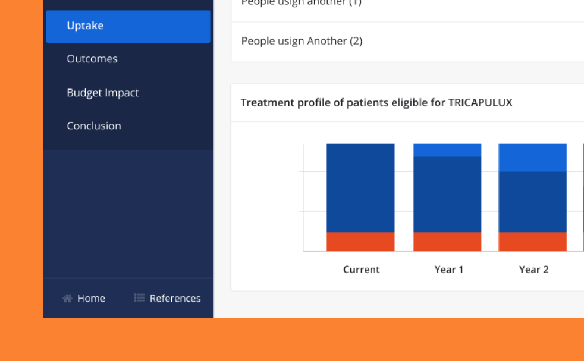
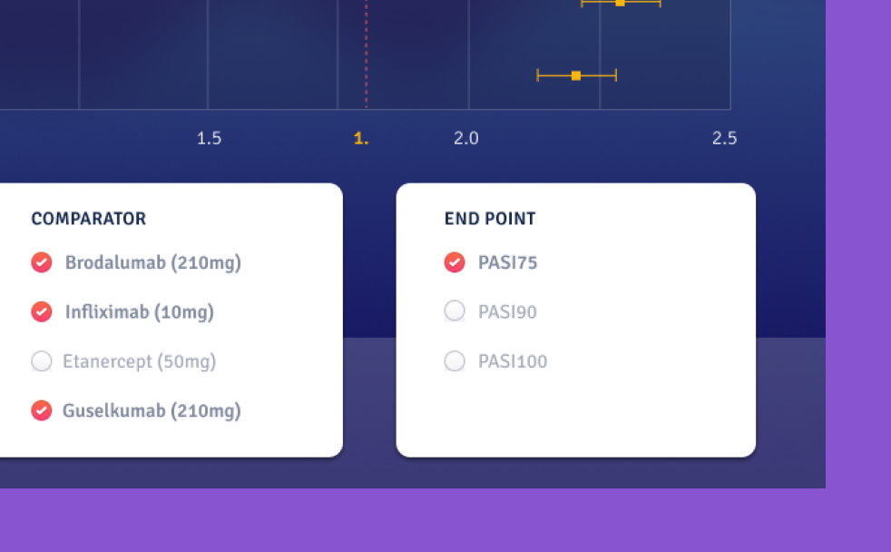

#### About BaseCase

BaseCase is a no-code platform that allows the users to translate spreadsheets into interactive & data-driven content, tailored for the health care and medical science business.

#### My role at Basecase

My collaboration began with assisting the Marketing team on the design of digital and physical brochures, along with the necessary images for the web and recurring social media campaigns. After expressing interest in building my own BaseCase apps, I became involved in the production of client-facing apps and responsible for the BaseCase Apps Library.

#### The Demo App Library

This library was a collection of tools that supported BaseCase's documentation. These tools would exemplify from BaseCase's more basic funtionalities until the most complex features, as well as product updates and use cases tutorials. I was fully responsible for the ideation, design (or redesign) and implementation of the tools.

<strong style="text-transform: uppercase">Process creating the tools</strong>

  
1
I would first translate the brief coming from the stakeholders, identifying the scope and usage of the demo

2
 Then I'd move into Sketch to create low-fi mockups and put all the ideation into place

3
The next step would be to create an imaginary healthcare brand, which included choosing colors, fonts and creating a logo.

4
 I would then move into BaseCase platform and implement the design and funcionality of the app

5
 Before moving the tool to QA, I would make a round of tests, ensuring that there was a proper usage of features and that calculations coming from the spreadsheets were performing correctly.

<<UPDATE WORKFLOW IMAGE>>

Close-up's to some of the tools that made part of the Demo App Library

#### Marketing Assets

With the need of suppporting Basecase's online presence, we developed a serie of images for marketing campaings that could go from the launching of new features until the participation of the company on fairs. I was also reponsible for the development of images used on Basecase website, some of them are still live under each category on https://basecase.com/features

Example of some of the Feature illustrations created for BaseCase's website

