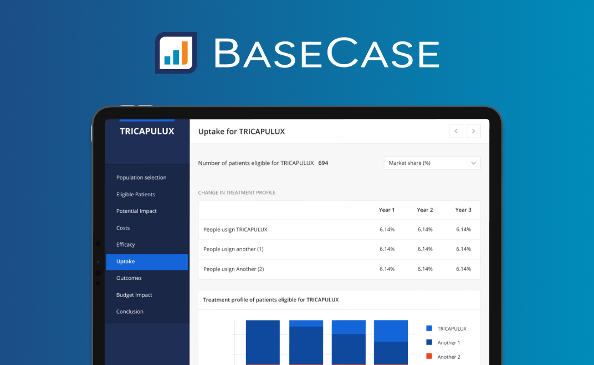
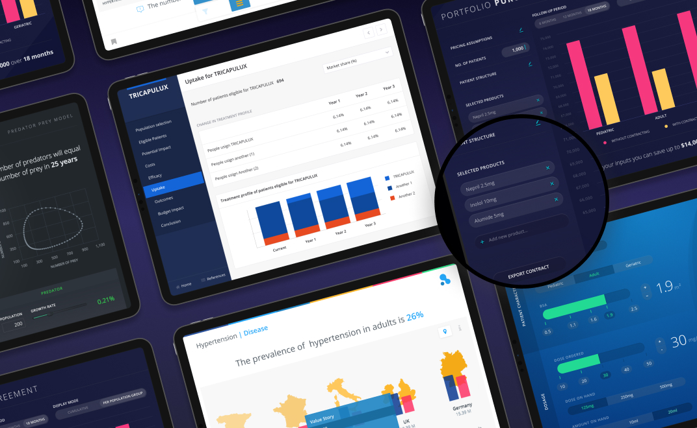
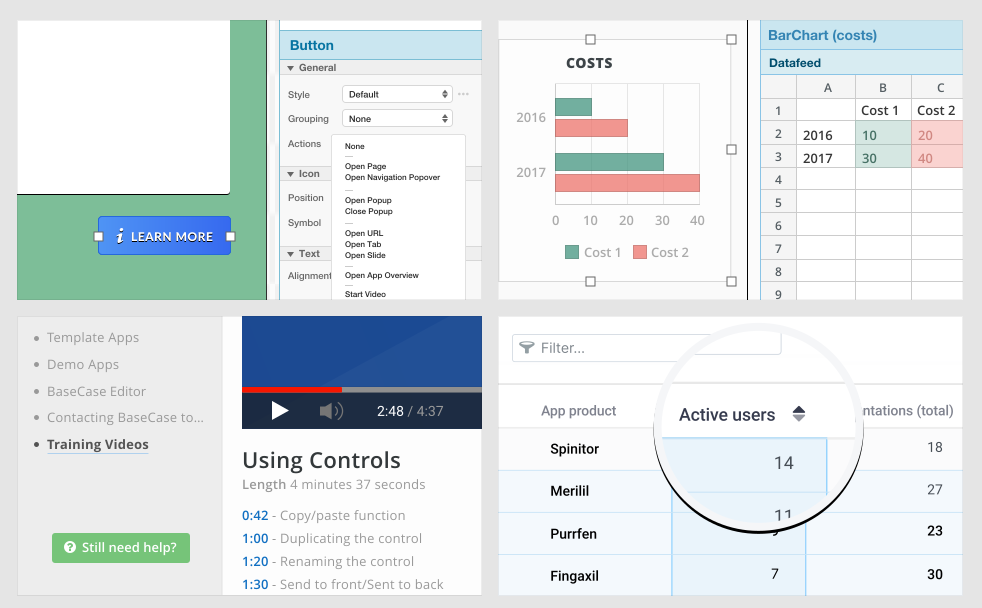

#### About BaseCase

BaseCase is a no-code platform that allows the users to translate spreadsheets into interactive & data-driven content, tailored for the health care and medical science business.

#### My role at Basecase

My collaboration began with assisting the Marketing team on the design of digital and physical brochures, along with the necessary images for the web and recurring social media campaigns. After expressing interest in building my own BaseCase apps, I became involved in the production of client-facing apps and responsible for the BaseCase Apps Library.

#### The Demo App Library

This library was a collection of interactive presentations showcasing the capabilities of the BaseCase platform as a data visualization tool. I was fully responsible for the conzeptualisation, design and implementation of the tools.

#### Marketing Assets

With the need of suppporting Basecase's online presence, we developed a serie of images for marketing campaings that could go from the launching of new features until the participation of the company on fairs. I was also reponsible for the development of images used on Basecase website, some of them are still live under each category on https://basecase.com/features

Example of some of the Feature illustrations created for BaseCase's website

