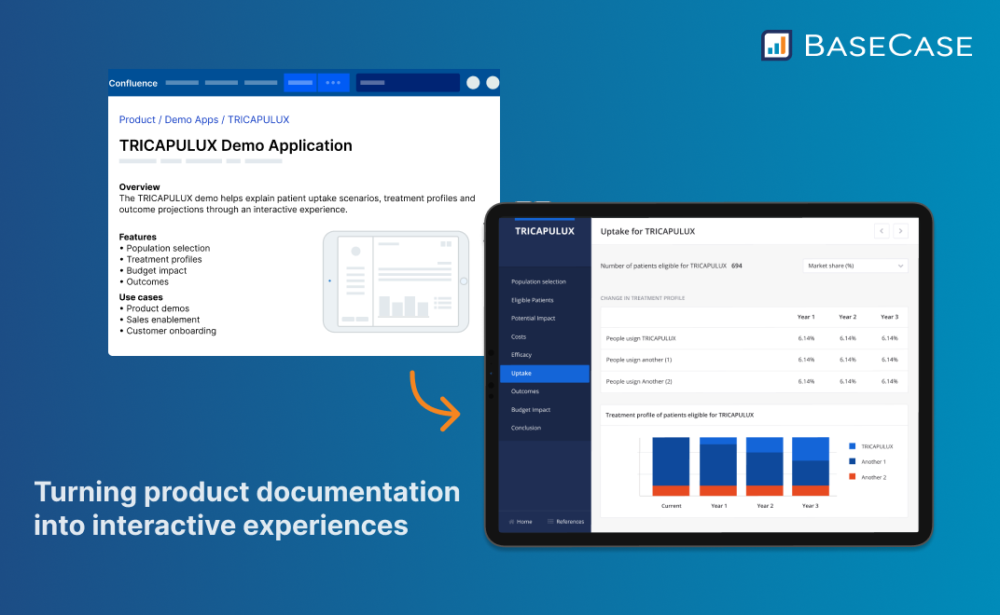
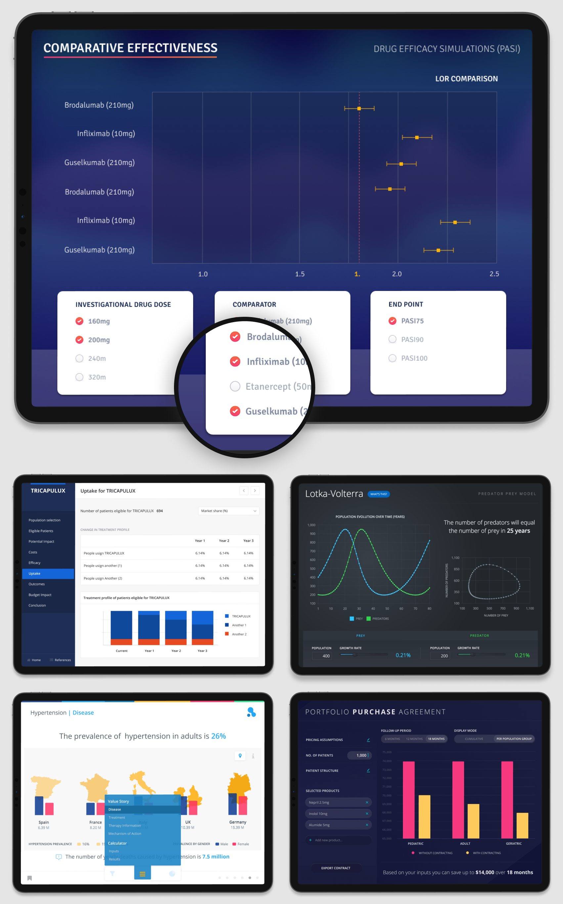
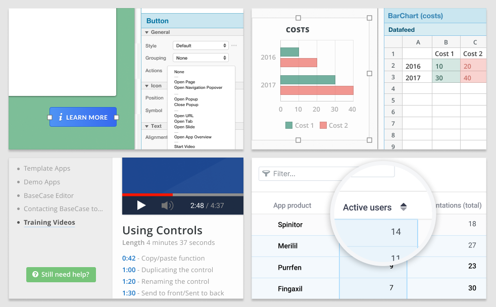
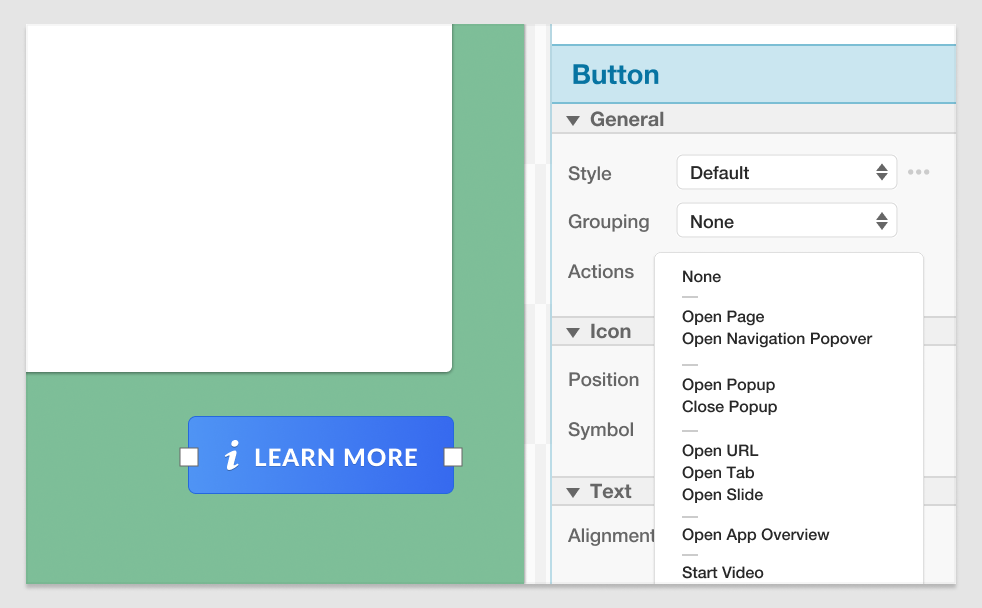
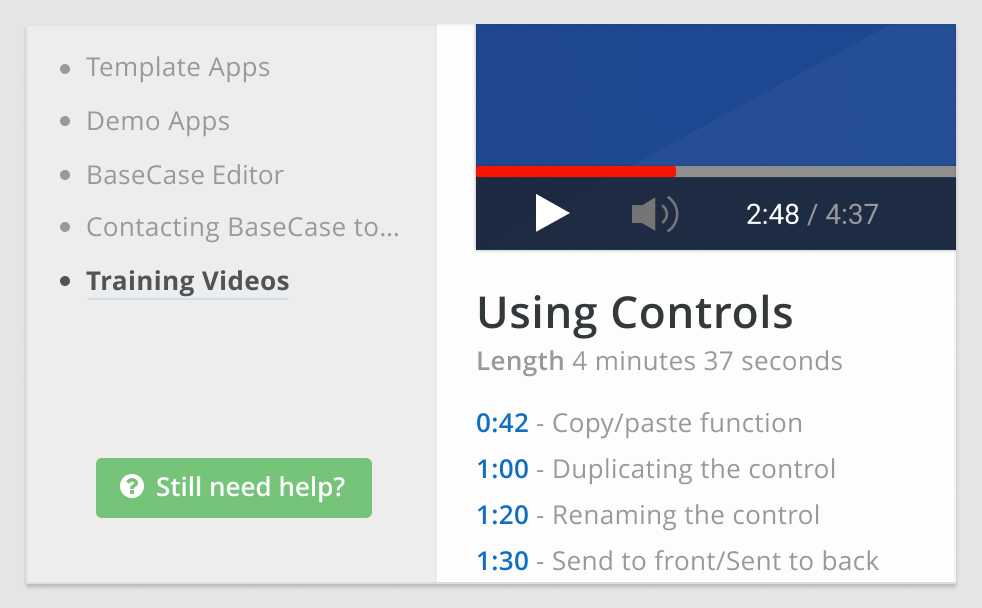
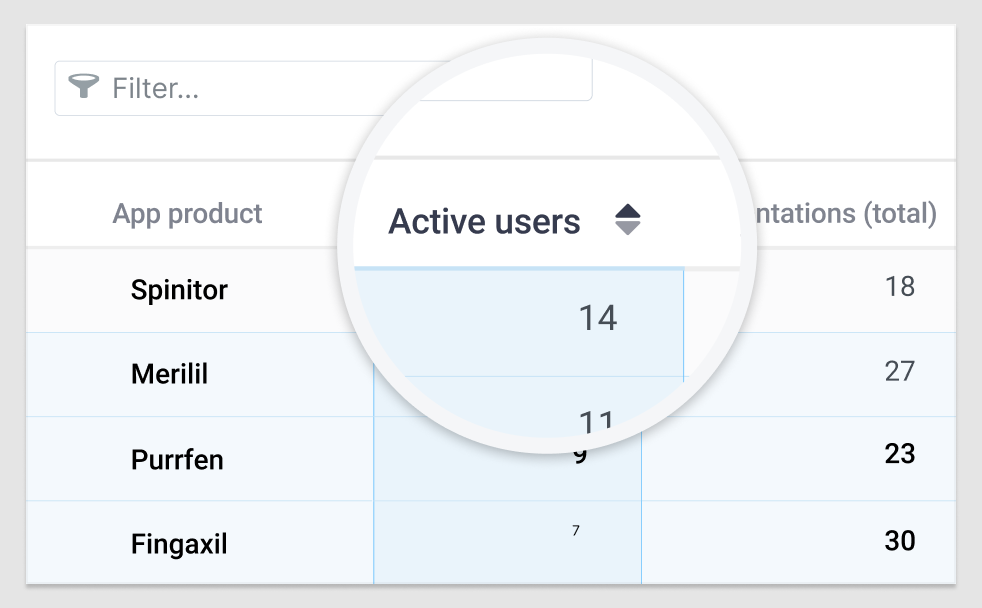

SaaS

BaseCase is a no-code platform that helps life sciences companies transform complex healthcare data into interactive product experiences. I gradually moved into UX/UI Design, creating client-facing tools, product documentation, and interactive demo applications that made complex workflows easier to understand.

  

    
 UX/UI Designer

    
 Berlin

    
 2017 - 2020

  

#### About BaseCase

**BaseCase** is a no-code platform used by life sciences companies to transform spreadsheets into digital applications for medical communication, product education, and sales enablement.

#### My role at Basecase

Working in a small cross-functional design team, I contributed across marketing, product documentation and UX/UI. As my role evolved, I became responsible for designing and building interactive demo applications used to explain product capabilities, new features and healthcare workflows.

  Complex software doesn't need more documentation, just better explanations.

#### The Demo App Library

My main responsibility was building a growing library of interactive demo applications used to communicate complex product capabilities and healthcare workflows.

The Demo App Library was a growing collection of interactive applications showcasing BaseCase's capabilities—from onboarding and feature walkthroughs to complex healthcare use cases.

I owned the end-to-end process, from understanding the brief and designing the experience to building the applications inside the BaseCase platform.

<strong style="text-transform: uppercase">Design Workflow</strong>

  
1
Understand the product feature and target audience

  
2
Explore concepts and wireframes in Sketch

  
3
Create a fictional healthcare brand and visual identity

  
4
Build the interactive experience in BaseCase

  
5
Test internally and iterate

  
6
Deliver for QA and documentation

Close-ups to some of the tools that made part of the Demo App Library

#### Marketing Assets

Beyond product experiences, I designed marketing visuals supporting feature launches, trade fairs and website content. Many of these illustrations were created for the BaseCase Features pages, helping communicate complex product capabilities through simple visual examples.

Example of some of the Feature illustrations created for BaseCase's website

