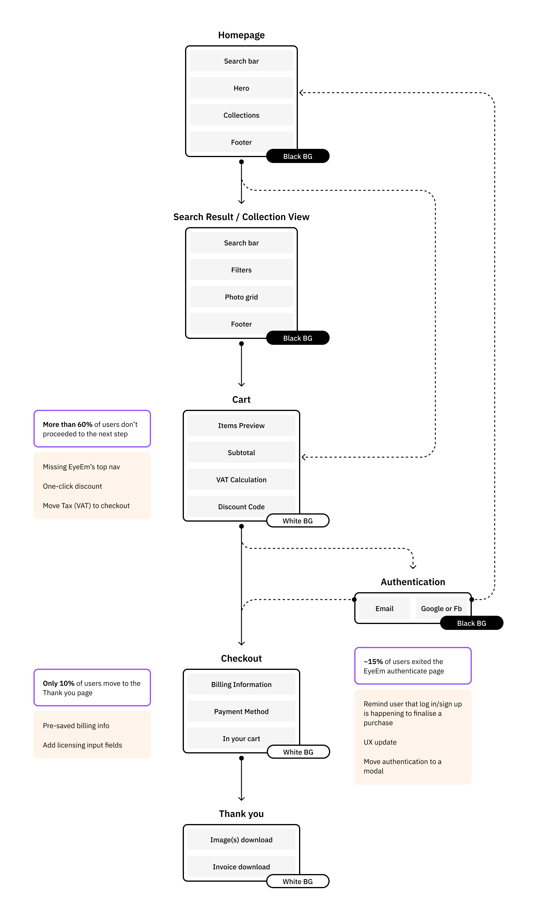
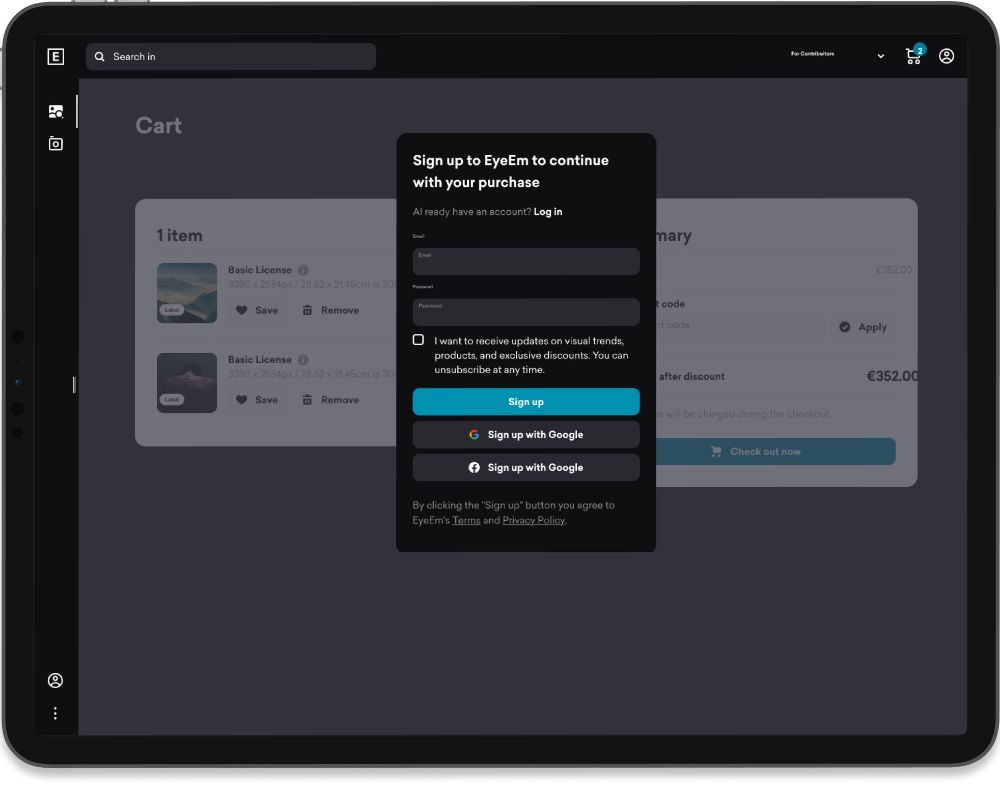
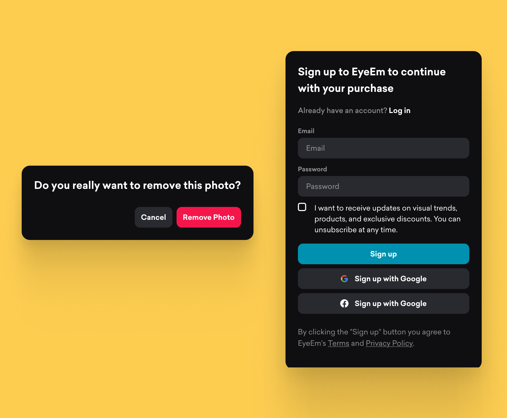
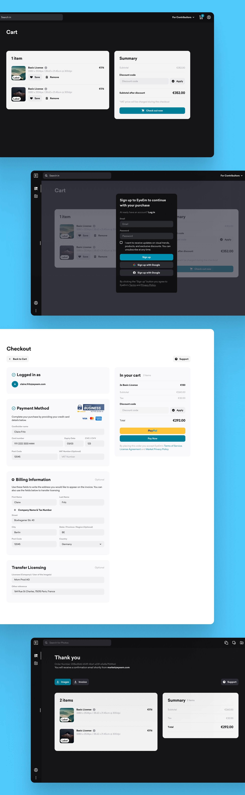
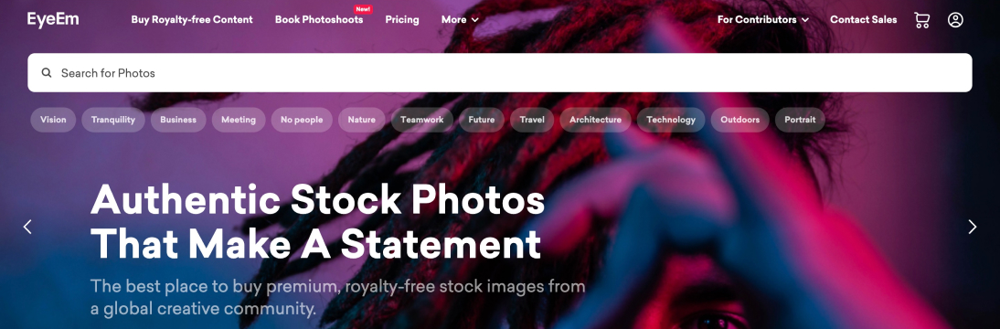
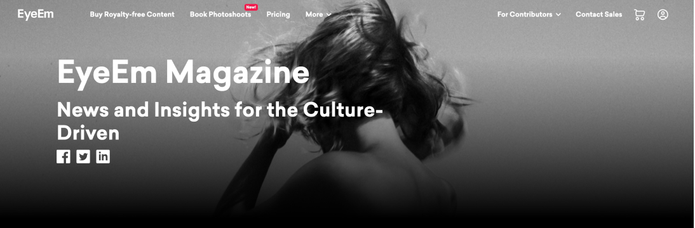
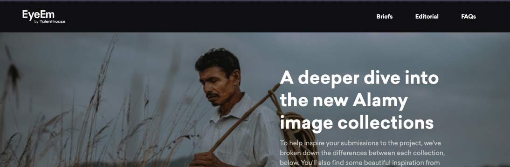

I worked in EyeEm for 2+ years, contributing on the brower-based platform, owning the Webflow account and helping with the recruitment of new designers to build a new Product Design Team.

  

    
 Product Designer

    
 Berlin, Hybrid

    
 2021 - 2023

  

#### About EyeEm

**EyeEm** is as a photography community and marketplace that facilitates connections between creators and prominent brands to source original and on-brand content.

#### My role at EyeEm

During my role at EyeEm I was one of Designers inside the Product team, specifically collaborating on the maintenance of the browser-based application. 

#### How we worked

Our Product Design team collaborated closely with project managers, data analysts, and developers. We worked toegether on the continuos development of the platform and set up regular meetings and feedback sessions. 

For the redesign of the Cart & Checkout process, I analyzed **data reports**, identified **pain points**, and proposed improvements. This included addressing UX improvements on the cart dropdown feature, background color inconsistencies, remature tax calculations, and issues with SSO implementation for logged-out users. I also collaborated with the legal team to ensure compliance with changes like pre-saving billing information and payment details. 

Identifying Data take-aways and UI pain points on the Cart & Checkout flow

#### Low-fi & Prototype

I created initial **prototypes** and discussed them with the Data and Front-End teams. Their feedback was crucial in finalizing a solution that addressed our quick wins. 

<a href="https://www.figma.com/proto/8uY2K7IVQ9ZY0zZ6nbfgLY/Cart-%26-Checkout-process-(Quick-wins)-(Copy)?page-id=2754%3A8279&node-id=2767-16673&viewport=831%2C395%2C0.06&t=CbdfJQfKEAJWeuO0-1&scaling=min-zoom&starting-point-node-id=2767%3A16673&show-proto-sidebar=1
" target="_blank">Check final prototype</a>

Prototyping the new behaviour of the cart dopdown

#### Hi-fi & Redesigned screens

The final step involved preparing high-fidelity mockups using our **design system**, ensuring consistency across the platform and alignment with the front-end developers' UI kit.

Glimpse to redesigned elements and screens

#### EyeEm's Web presence

<a href="http://eyeem.com" target="_blank">EyeEm.com </a> combines the flexibility of **Webflow** with the capabilities of front-end development, giving designers complete control over the UI and behavior of some areas of the website. I maintained various site areas and frequently launched landing pages for marketing campaigns, collaborating with the Marketing and Innovation teams. I was responsible for ideation, design, implementation, and final release of these projects.

Here are some live examples:

<a href="http://eyeem.com" target="\_blank">eyeem.com</a>

<a href="https://www.eyeem.com/magazine" target="_blank">eyeem.com/magazine

<a href="https://www.eyeem.com/awards" target="\_blank">eyeem.com/awards

<a href="https://creativetrends.eyeem.com/" target="\_blank">creativetrends.eyeem.com

