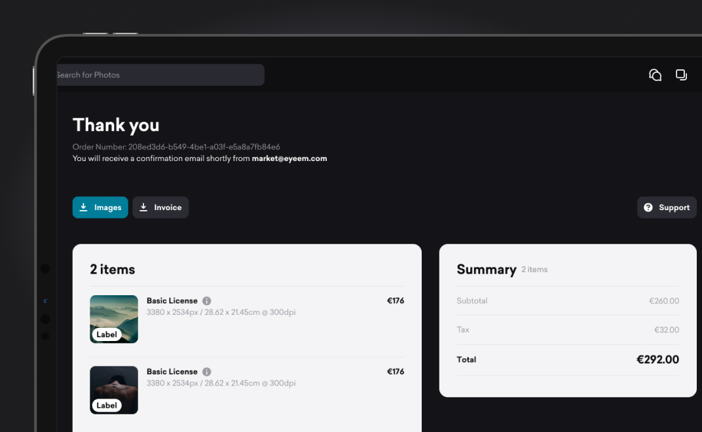
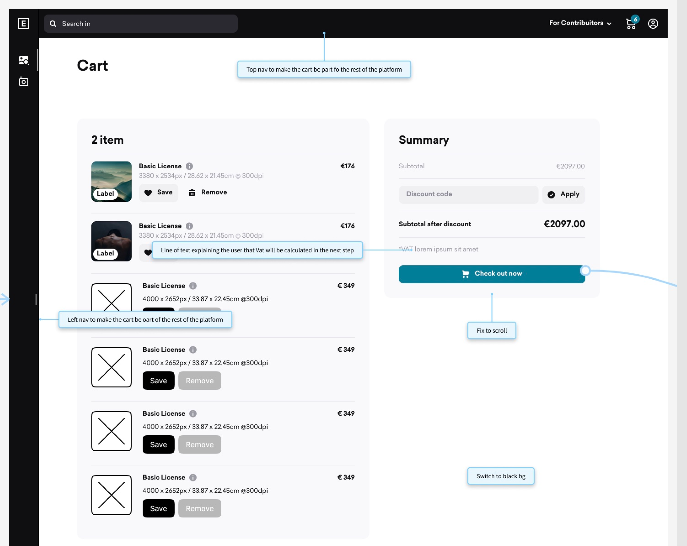
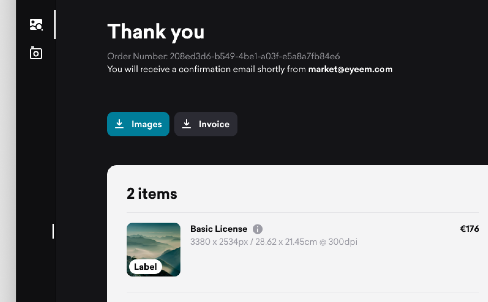

#### About EyeEm

**EyeEm** is as a photography community and marketplace that facilitates connections between creators and prominent brands to source original and on-brand content.

#### My role at EyeEm

During my role at EyeEm, I was part of the Product Desgin team collaborating on platform maintenance, conducting research, designing new features, prototyping, and testing solutions.

#### The Platform

EyeEm is a browser-based platform for photographers to get discovered and for brands to access a curated selection of images, dividing the user base into two main groups: the creators and the buyers.

#### EyEem's Cart & Checkout Flow

Our Product Design team worked closely with data analysts and developers. In the case of the Cart & Checkout re-vamp, I reviewed the data research and report made by the team on the previous months, to then create a descriptive analysis and map the pain points of the flow.

<<IMAGE OF ALL FLOW WITH PAINPOINTS AND DATA TAKE-AWAYS>>

Identifying Data take-awys and pain points on the flow

These were the take-aways we got from identifying all pain points in the flow:

  <strong>Quick fixes</strong>
    <ul class="no-margin-bottom">
      <li>Inconsistency in bg color</li>
      <li>Calculate Tax (VAT) after users log in and only one step ahead from the purchase</li>
      <li>Remind users during the authentication that they are performing a purchase</li>
      <li>Adjust the flow for users authenticating with Google and Facebook</li>
      <li>Pre-save billing and payment details / Make billing address to be optional</li>
      <li>Add licensing fields</li>
    </ul>

 

<strong>Long-term fixes</strong> (becoming relevant after the first test rounds)
    <ul class="no-margin-bottom">
      <li>Introduce guest checkout</li>
      <li>Apply single-click sign up</li>
    </ul>

#### Low-fi & Prototype

We iterate different possible solutions in Figma, coming out with a solution that ticked all the Quick fixes boxes and at the same time took in consideration the constraints from the legal team and the capacity of the developers.

<a href="https://www.figma.com/proto/8uY2K7IVQ9ZY0zZ6nbfgLY/Cart-%26-Checkout-process-(Quick-wins)-(Copy)?page-id=2754%3A8279&node-id=2767-16673&viewport=831%2C395%2C0.06&t=CbdfJQfKEAJWeuO0-1&scaling=min-zoom&starting-point-node-id=2767%3A16673&show-proto-sidebar=1
" target="_blank">Check final prototype

Figma screenshot from the Low-fi Prototype on the Cart phase, marking UI and interaction issues

#### Hi-fi & Redesigned screens

The high-resolutions screens were built usign EyeEm's Design system to ensure consistency with the rest of the platform and offer the user a smooth experience.

Close-up to the Hi-fi redesigned screens. On top, the Cart view with the Authentication screen in overlay. Below, a segment of the Optional Billing update. At the bottom, a section of the Thank you screen at the end of the purchase.

#### EyeEm's Web presence

<a href="http://eyeem.com" target="_blank">EyeEm.com </a> combines the flexibility of Webflow with the capabilities of front-end development, giving designers complete control over the UI and behavior of some areas of the website. During my time at EyeEm, I was responsible for maintaining these areas of the site.

In addition to the main webpage, EyeEm frequently launched landing pages to support ongoing marketing campaigns. Collaborating closely with the Marketing and Innovation teams, I was involved in the ideation and design of these sites. I then took full responsibility for the implementation and final release of these web projects using Webflow, sharing account control with the Front-End team.

Here are some live examples:

<a href="http://eyeem.com" target="_blank">eyeem.com</a>

<a class="inline-link" href="https://www.eyeem.com/magazine" target="_blank">eyeem.com/magazine

<a href="https://www.eyeem.com/awards" target="_blank">eyeem.com/awards

<a href="https://creativetrends.eyeem.com/" target="_blank">creativetrends.eyeem.com

