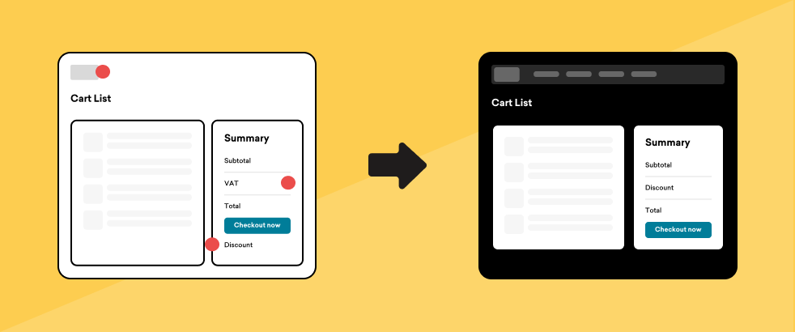
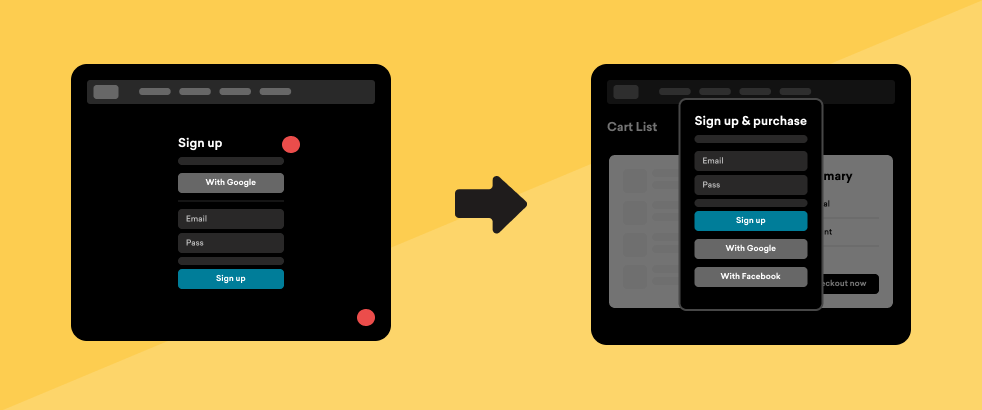

e-commerce

I worked in EyeEm for 2+ years, contributing on the brower-based platform, owning the Webflow account and helping with the recruitment of new designers to build a new Product Design Team.

  

    
 Product Designer

    
 Berlin, Hybrid

    
 2021 - 2023

  

### About EyeEm

**EyeEm** is as a photography community and marketplace that facilitates connections between creators and prominent brands to source original and on-brand content.

### My role at EyeEm

During my role at EyeEm I was one of Designers inside the Product team, specifically collaborating on the maintenance of the browser-based application.

### How we worked

Our Product Design team collaborated closely with project managers, data analysts, and developers. We worked together on the continuos development of the platform and set up regular meetings and feedback sessions.

For the redesign of the Cart & Checkout process, we analyzed **data reports**, identified **pain points**, elaborated hypothesis and proposed improvements. This included addressing UX improvements on the cart dropdown feature, background color inconsistencies, premature tax calculations, and issues with SSO implementation for logged-out users. We also collaborated with the legal team to ensure compliance with changes like pre-saving billing information and payment details.

Identifying Data take-aways and UI pain points on the Cart & Checkout flow

### UX Exploration

#### Cart Page

With a <strong>60% drop-off rate</strong> among <strong>logged-out users</strong> before reaching the authentication step, we wanted to identify the main pain points on the Cart page.

##### Top Navigation

The Cart page **lacked EyeEm's familiar top navigation**, which could make users feel as though they’d left our site, potentially impacting trust. We hypothesized that reintroducing the top navigation might improve user confidence and retention.

##### VAT Calculations

VAT calculations were appearing **too early in the cart flow**. As users added more items, the displayed total rose significantly, which might discourage them. We considered moving VAT calculations closer to the payment step to present a more approachable total earlier in the process.

#### Authentication for logged out users

<strong>Approximately 15% of users were dropping off</strong> on the Authentication screen. We required logged-out users to log in or create an account before proceeding, but this interruption often disrupted their flow.

##### Authentication Modal

To create a more seamless experience, we moved authentication to a modal, **allowing users to keep their Cart in view** while logging in or signing up.

##### UX writing

To keep users engaged, we explored updating our UX copy with **clearer instructions**, gently reminding users they were in the middle of a purchase.

##### Guest Checkout: Long-term goals

We also discussed the potential for a Guest Checkout, allowing users to **skip authentication until later stages**. While this feature wasn’t implemented in this iteration, it remains a consideration for the future.

#### Checkout Page

<strong>Only 10% of users</strong> who reached the Checkout page <strong>completed their purchase</strong>, highlighting a need to streamline this stage. We aimed to compress the steps required and reduce user interactions.

##### Cart Preview, Pay Now & One-click Paypal payment

Previously, the "Pay Now" action was hidden in the second step and often inaccessible with longer Cart lists. We **standardized the Cart preview** by grouping items by license type, which kept the "Pay Now" and one-click PayPal options in view, encouraging **quicker decision-making**.

##### Optional billing info

Since our product **didn’t require a shipping address** and billing details were often unnecessary for users paying with PayPal, we considered making these fields optional to streamline the checkout experience.

##### Transfer Licensing

Many of our users—often designers or agencies buying for clients—needed an option to transfer licensing directly to their clients. Previously, they had to call Support to complete this transaction. By adding this feature to the redesign, we **streamlined the process** and responded to a frequent user need.

##### Introducing more payment methods: Long term goals

To enhance convenience, we considered adding **more one-click payment options**, such as Apple Pay and Google Pay, in future iterations.

### Low-fi & Prototype

We created initial **prototypes** and discussed them with the Data and Front-End teams. Their feedback was crucial in finalizing a solution that addressed our quick wins.

<a href="https://www.figma.com/proto/8uY2K7IVQ9ZY0zZ6nbfgLY/Cart-%26-Checkout-process-(Quick-wins)-(Copy)?page-id=2754%3A8279&node-id=2767-16673&viewport=831%2C395%2C0.06&t=CbdfJQfKEAJWeuO0-1&scaling=min-zoom&starting-point-node-id=2767%3A16673&show-proto-sidebar=1
" target="_blank" style="display:none">Check final prototype</a>

Prototyping the new behaviour of the cart dopdown

### Hi-fi & Redesigned screens

The final step involved preparing high-fidelity mockups using our **design system**, ensuring consistency across the platform and alignment with the front-end developers' UI kit.

Glimpse to redesigned elements and screens

### EyeEm's Web presence

<a href="http://eyeem.com" target="_blank">EyeEm.com </a> combines the flexibility of **Webflow** with the capabilities of front-end development, giving designers complete control over the UI and behavior of some areas of the website. I maintained various site areas and frequently launched landing pages for marketing campaigns, collaborating with the Marketing and Innovation teams. I was responsible for ideation, design, implementation, and final release of these projects.

Here are some live examples:

<a href="http://eyeem.com" target="\_blank">eyeem.com</a>

<a href="https://www.eyeem.com/magazine" target="_blank">eyeem.com/magazine

<a href="https://www.eyeem.com/awards" target="\_blank">eyeem.com/awards

<a href="https://creativetrends.eyeem.com/" target="\_blank">creativetrends.eyeem.com

