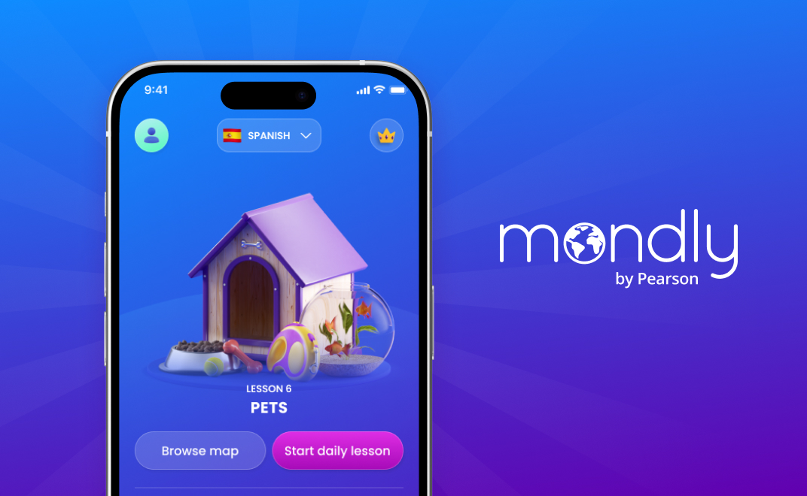
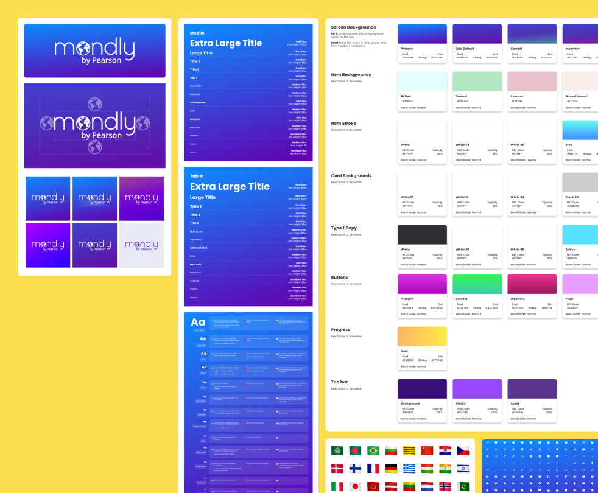
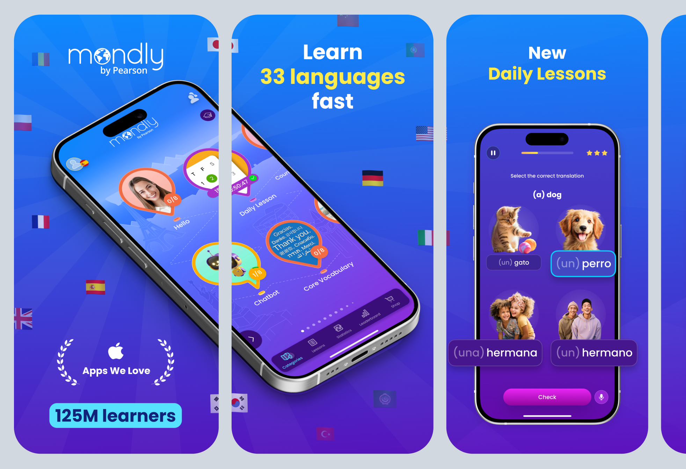
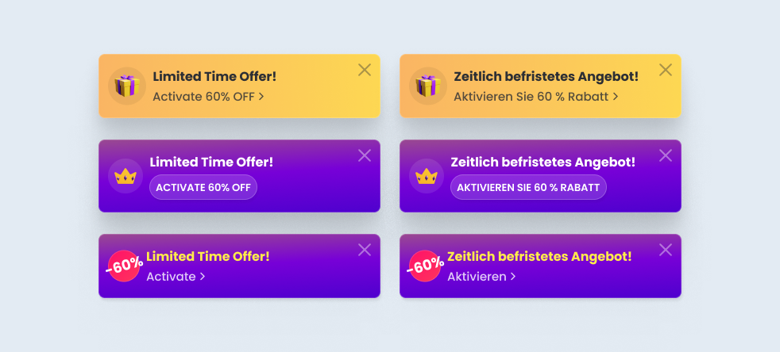
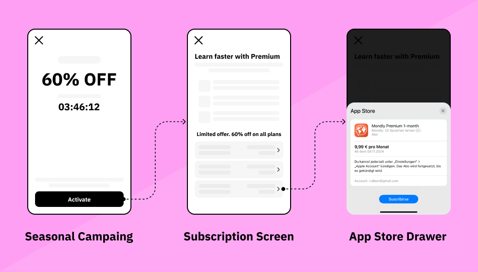
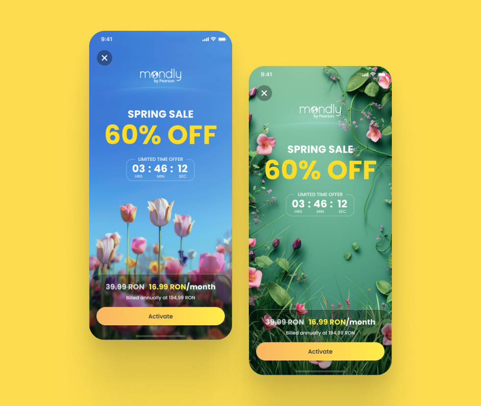
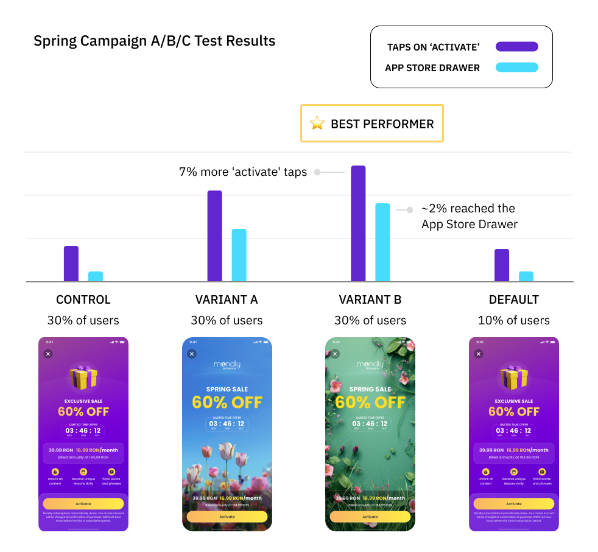
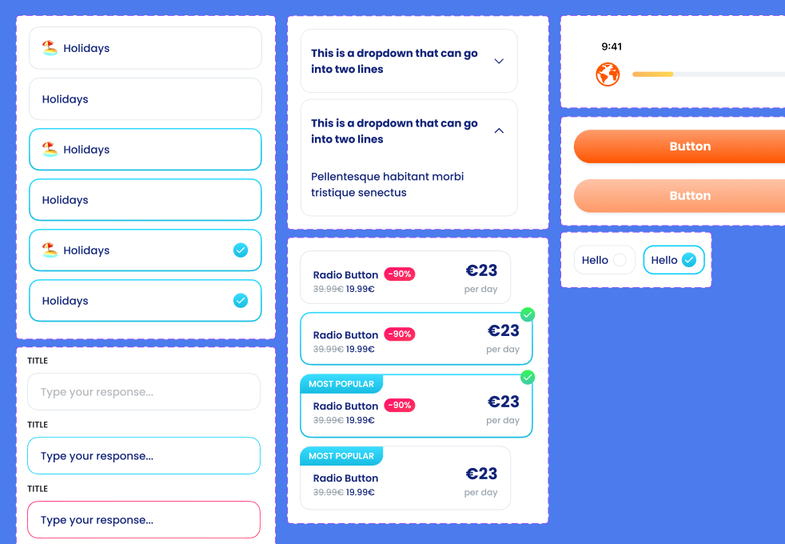

e-learning

My role at Mondly involved a variety of tasks, collaborating closely with designers, marketers, User Acquisition and Growth specialists, website developers, and data scientists to consolidate Mondly's rebrand across all touchpoints.

  

      
 Senior Product Designer

      
 Fully remote

      
  2023 - 2024

  

### About Mondly

**Mondly** is a language learning app that aims to make language learning fun and easy through technological innovation and multiple lanaguage combinations.

On 2022 Mondly got acquired by Pearson, giving the Product team a chance for a big redesign of Mondly's platform and web presence.

### My Role at Mondly

During my stay at Mondly, making **A/B tests** about the performance of the Old vs. the New Design was important to validate with data the development of the rebrand and plan the marketing strategies for this design transition.

Before I joined the team, the product designers put in place a detailed **design system** that served as base for all the future assets we developed on the way. I collaborated closely with one of my colleagues on the creation of a **style guide** in Notion, were we documented the details of the New Mondly Brand and its usage.

View of some of the components built for the Styleguide in Figma

### Mondly Web & Marketing

With a major rebranding underway, we created brand guidelines based on our design system that we could extend into marketing materials. We conducted a series of **A/B tests** to compare the performance of the **new design versus the old one**, ensuring a positive impact on user engagement.

#### Redesigned Offer page

For this project, we adapted the app’s design system for use on a marketing landing page for the first time. This laid the foundation for a **scalable design system** tailored to **web marketing materials**, evolving with the team’s needs. It also enabled us to expand the style guide specifically for marketing designers, who would use it in areas such as social media campaign ideation.

Preview of the Offer Page redesign on iPad mini and iPhone SE

 The redesigned Offer page resulted in an increase in <strong>average time on page</strong> and the <strong>unique pageviews</strong> compared to the original control version.

#### App Store & Google Play images

In order to test the impact of the rebranding on the Stores, we initiated a project to extend the new brand to these images. The light mode was introduced after benchmarking research showed competitors favoring light backgrounds in their App Store images. We organized several **Design Team workshops** to develop a light version of our new brand, allowing us to include it in the **A/B testing.**

 

 

Screenshots of the light and dark versions of the App Store images for iPhone X

 Data showed a <strong>nearly 3% increase in App Store downloads</strong> with <strong>Mondly's Light theme</strong> version compared to the control and dark theme variants. With this percentage we met our OKRs for Q1 2024

### Mondly Growth & Monetization

The Growth team initiated several **A/B tests** to **increase Premium Subscriptions**. We tested various strategies, including designing new banners, creating templates for seasonal campaigns, and making UX improvements to the Free Trial screen.

Preview of the Limited Time Offer Banner variants for testing

#### Seasonal Campaigns

One of our user acquisiton strategies was the implementation of full-screen in-app ads that would lead the Free Trial Users to the the Subscription screen, giving them the oportunity to activate their Premium account.

User conversion through in-app ads flow

Our strategy consisted in having a default layout version of the ad running for all free users, but we would adapt the layout of the screen accordingly to the seasonal sale. This made us create a template that we could adapt to the seasonal theme by adapting key elements like colors and imaginery.

In-app ad layout created for the Spring Campaign. Images generated with Midjourney

For the **Spring Campaign 2024**, we developed a new layout for the in-app ad and proposed two different background images. We launched both variants and conducted an **A/B/C test** alongside the current fallback.

 Results showed a slight increase of <strong>7% more 'Activate' taps</strong> between variants A and B, with <strong>variant B performing better</strong>. Nearly <strong>2% of users</strong> who reached the Subscription screen <strong>reached the App Strore Drawer</strong></strong>

### Marketing Campaigns

One major ongoing marketing campaign involved creating an onboarding flow with a questionnaire that guided users to a payment screen. I was responsible for the design and UX of this flow. The biggest challenge was developing a style that seamlessly blended elements of both the old and new Mondly branding.

Figma screenshot from the W2W campaing mockups and components in Figma

