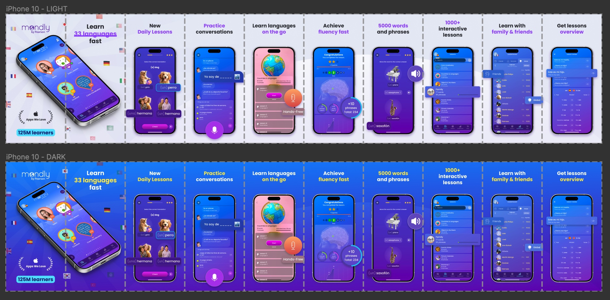
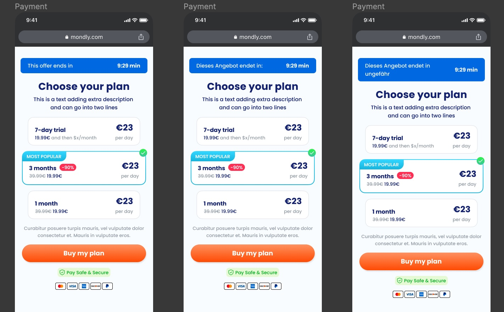

### About Mondly

Mondly is a language learning app which mission is to build bridges between people and cultures by making language learning fun and easy through technological innovation.

On 2022 Mondly got acquired by Pearson, giving the Product and Marketing team a chance for a big redesign of Mondly's platform and web presence.

### My Role at Mondly

Making AB Test about the performance of the Old Design vs. the New one was crucial to understand the future marketing and design steps of the company. Before I joined the team, the product designers put in place a detailed Design System that served as base for all the future assets we developed on the way.

Inside our Product Team, I collaborated closely with one of my colleagues on the creation of a Styleguide in Notion, were we documented all the important aspects of the New Mondly Brand that we were building up.

<<STYLEGDUIDE FIGMA SCREENSHOT>>

### Mondly Web & Marketing

Some of the tests we made included the redesign of the Offer page and the App and Google Store images, both resulting on a increase of user engagement of 3% on the Offer page and an increase of almost 5% of App Store downloads with Mondly's dark theme version.

  The Light mode was introduce upon request from the User Acquisition Team under the assumption that images with light background perform better on the stores. We, the design team, did't count with a light theme beofre this project.

 Screenshot from the light and dark version of the App Store images for iPhone 10

### Mondly Growth

More AB Tests were coming from the Growth team, which whom we were mostly testing different stategies to increase the number of Premium Subscriptions. Some of these strategies included the design of new banners, new templates for seasonal campaigns and UX changes on the Free Trial screen.

New In-App Add design created for the Spring Campaign

### Marketing Campaigns

A big ongoing Marketing campaing was the building of an onboarding flow with a questionnaire that would lead the user to a payment screen. For this project I took responsibility of the design and UX of the flow. Tne biggest challenge was to come up with a style that would feel like the old and new Mondly at the same time

