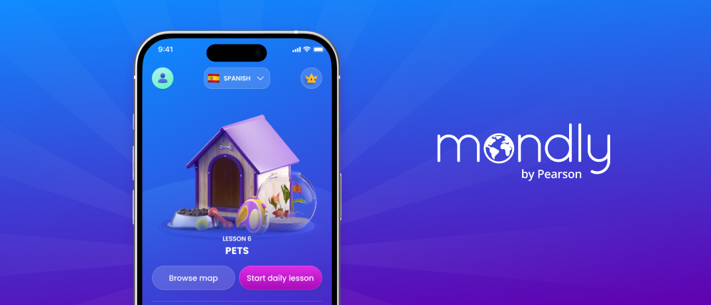
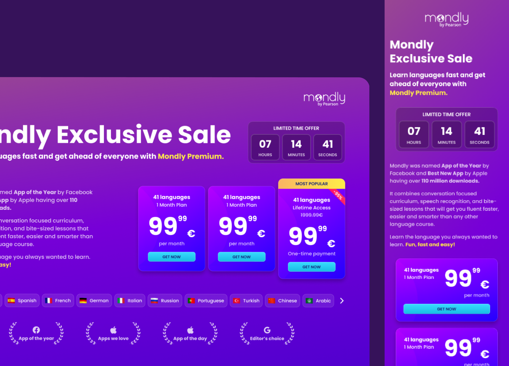
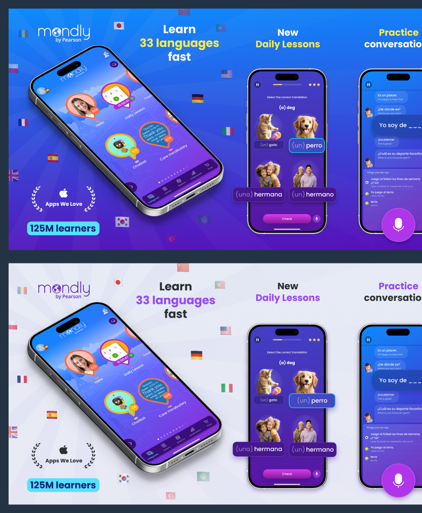
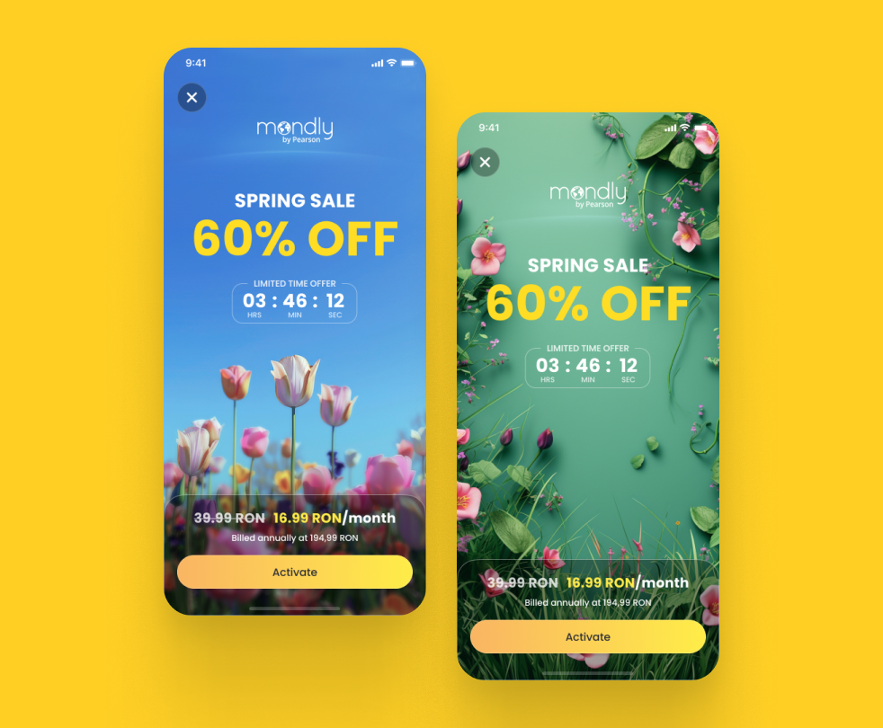
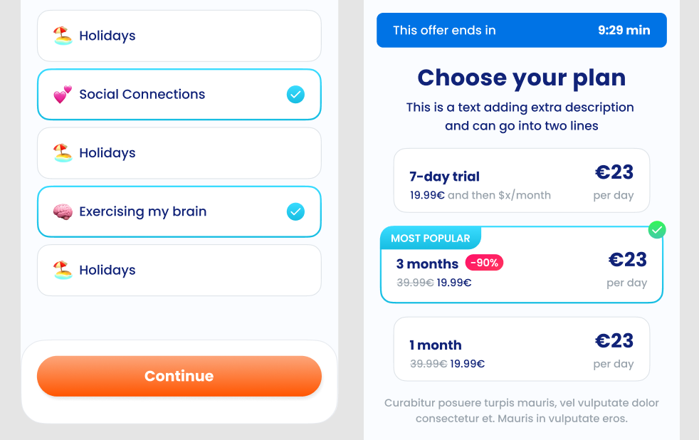

### About Mondly

Mondly is a language learning app that aims to make language learning fun and easy through technological innovation and multiple lanaguage combinations.

On 2022 Mondly got acquired by Pearson, giving the Product team a chance for a big redesign of Mondly's platform and web presence.

### My Role at Mondly

During my stay at Mondly, making AB Tests about the performance of the Old vs. the New Design was important to validate with data the development of the rebrand and plan the marketing strategies for this design transition.

Before I joined the team, the product designers put in place a detailed Design System that served as base for all the future assets we developed on the way. I collaborated closely with one of my colleagues on the creation of a Styleguide in Notion, were we documented all the important aspects of the New Mondly Brand.

<<STYLEGDUIDE FIGMA SCREENSHOT>>

### Mondly Web & Marketing

Some of the tests we made included the redesign of the Offer page and the App and Google Store images, both resulting on a increase of average time on page and the unique pageviews on the Offer page and an increase of almost 3% of App Store downloads with Mondly's dark theme version, meeting our team OKR's for Q1 in 2024.

 Screenshot from the light and dark version of the App Store images for iPhone 10

 Screenshot from the light and dark version of the App Store images for iPhone 10

  Light mode was introduced based on a benchamrk research which show competitors choosing light backgrounds on their app store images. We organized several Design Team workshops to develop a light version of our new brand, that we could include on the A/B Testing.

### Mondly Growth

The Growth team initiated several A/B tests aimed at increasing Premium Subscriptions. We tested various strategies, including designing new banners, creating templates for seasonal campaigns, and making UX improvements to the Free Trial screen.

New layout for the in-App adds created for the Spring Campaign. The background image was generated using Midjourney

<<PREMIUM SCREEN TEST FIGMA SCREENSHOT>>

### Marketing Campaigns

One major ongoing marketing campaign involved creating an onboarding flow with a questionnaire that guided users to a payment screen. I was responsible for the design and UX of this flow. The biggest challenge was developing a style that seamlessly blended elements of both the old and new Mondly branding.

Figma screenshot from the W2W campaing mockups

