

e-learning

My role at Mondly involved a variety of tasks, collaborating closely with designers, marketers, User Acquisition and Growth specialists, website developers, and data scientists to consolidate Mondly's rebrand across all touchpoints.

  

      
 Senior Product Designer

      
 Fully remote

      
  2023 - 2024

  

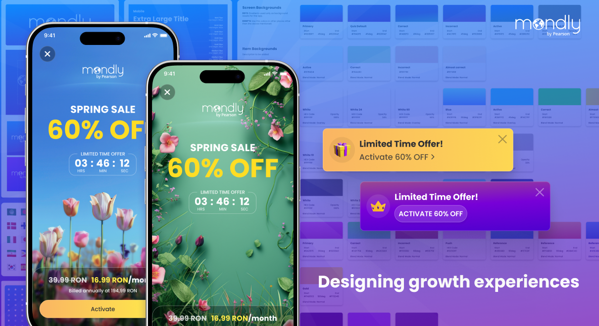

### About Mondly

**Mondly** is a language learning app that aims to make language learning fun and easy through technological innovation and multiple language combinations.

On 2022 Mondly got acquired by Pearson, giving the Product team a chance for a big redesign of Mondly's platform and web presence.

### My Role at Mondly

During my stay at Mondly, making **A/B tests** about the performance of the Old vs. the New Design was important to validate with data the development of the rebrand and plan the marketing strategies for this design transition.

Before I joined the team, the product designers put in place a detailed **design system** that served as base for all the future assets we developed on the way. I collaborated closely with one of my colleagues on the creation of a **style guide** in Notion, were we documented the details of the New Mondly Brand and its usage.

<a href="images/styleguide-components.png" class="lightbox">
  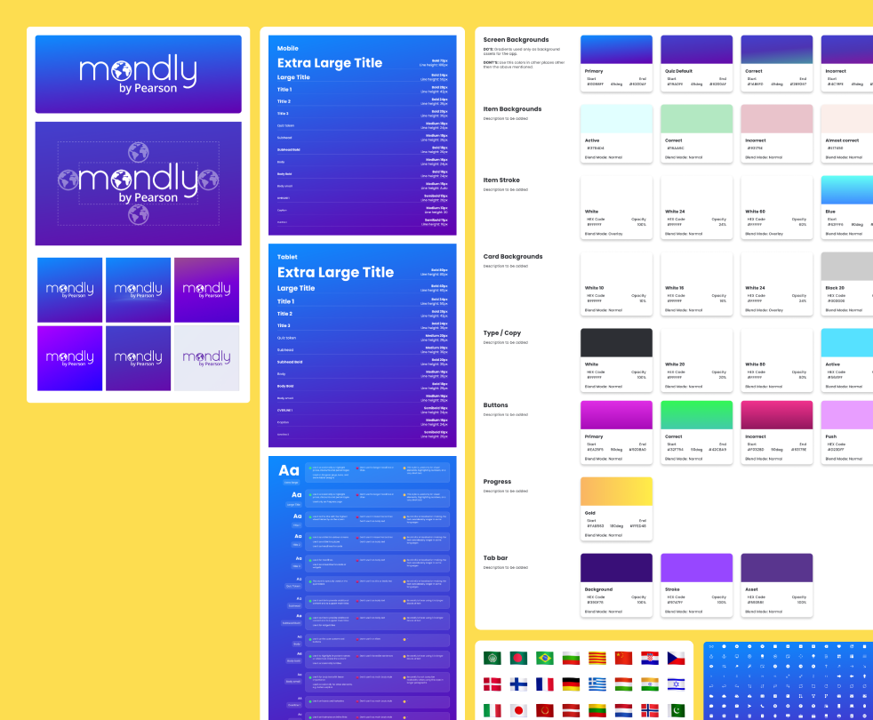
</a>

View of some of the components built for the Styleguide in Figma

### Mondly Web & Marketing

With a major rebranding underway, we created brand guidelines based on our design system that we could extend into marketing materials. We conducted a series of **A/B tests** to compare the performance of the **new design versus the old one**, ensuring a positive impact on user engagement.

#### Redesigned Offer page

For this project, we adapted the app’s design system for use on a marketing landing page for the first time. This laid the foundation for a **scalable design system** tailored to **web marketing materials**, evolving with the team’s needs. It also enabled us to expand the style guide specifically for marketing designers, who would use it in areas such as social media campaign ideation.

  

    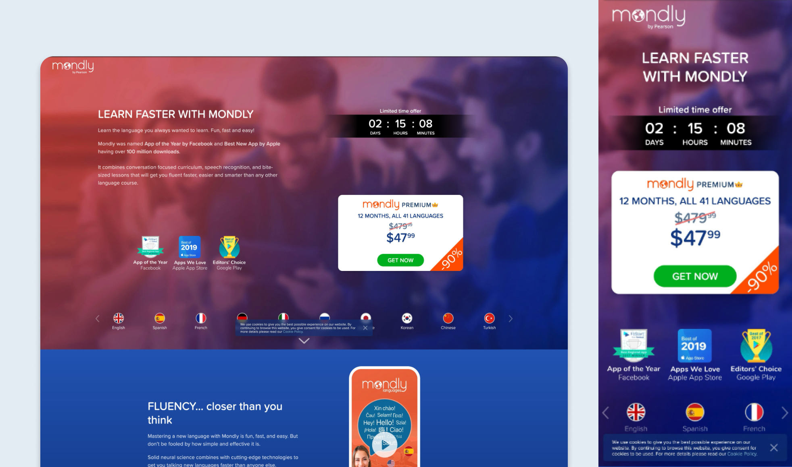
    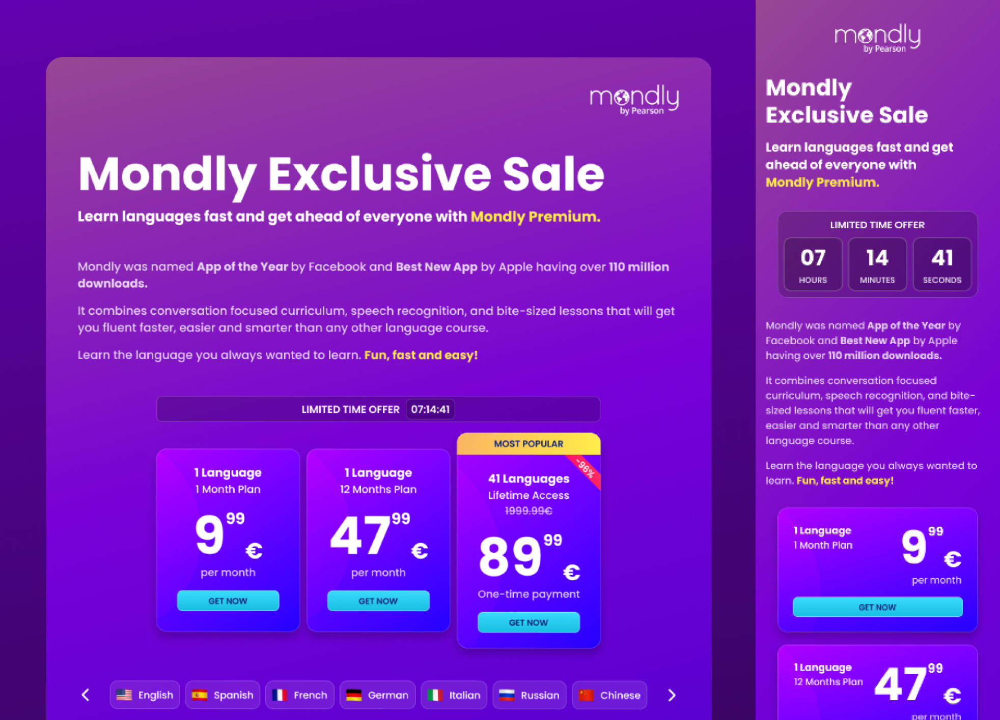
  

  

    <button class="btn-before">Before</button>
    <button class="btn-after active">After</button>
  

Before: Mondly's old Offer page design. After: Redesigned Offer Page on iPad&nbsp;mini and iPhone&nbsp;SE

 The redesigned Offer page resulted in an increase in <strong>average time on page</strong> and a lower <strong>bounce rate</strong> compared to the original control version.

#### App Store & Google Play images

In order to test the impact of the rebranding on the Stores, we initiated a project to extend the new brand to these images. The light mode was introduced after benchmarking research showed competitors favoring light backgrounds in their App Store images. We organized several **Design Team workshops** to develop a light version of our new brand, allowing us to include it in the **A/B testing.**

 <a href="images/app-store-images-dark.png" class="lightbox">
   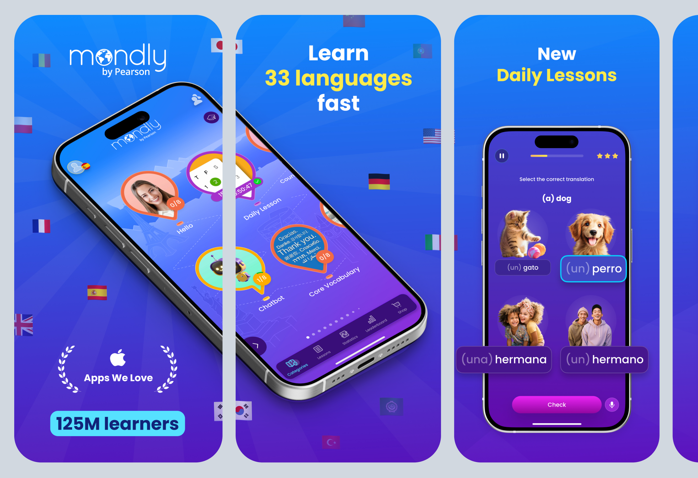
 </a>

 <a href="images/app-store-images-light.png" class="lightbox">
   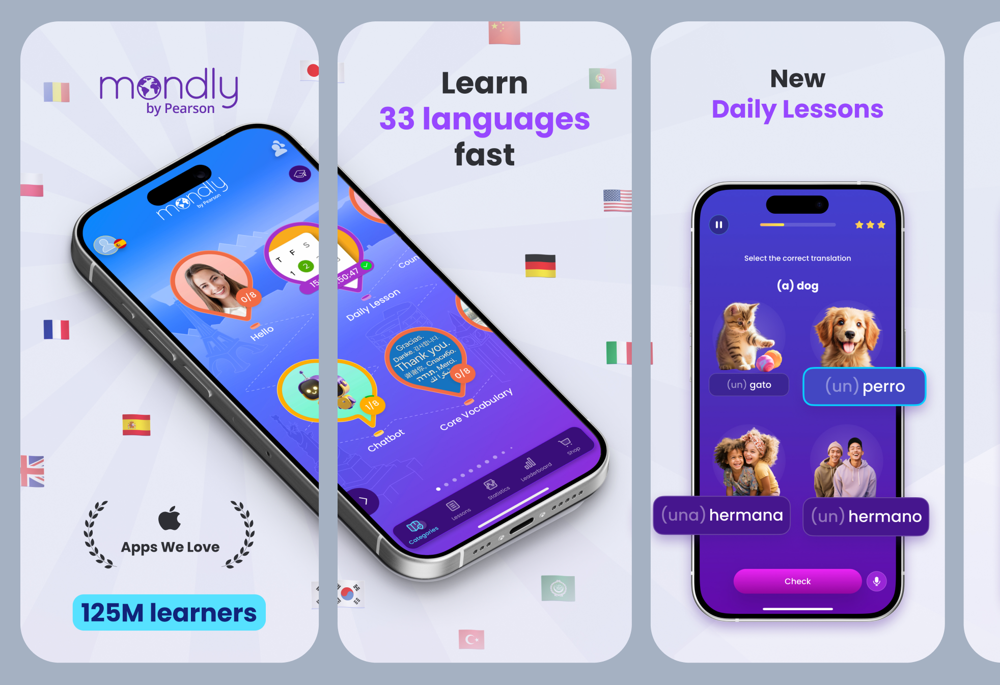
 </a>

Screenshots of the dark and light versions of the App Store images for iPhone X

 Data showed a <strong>nearly 3% increase in App Store downloads</strong> with <strong>Mondly's Light theme</strong> version compared to the control and dark theme variants. With this percentage we met our OKRs for Q1 2024

#### Balancing Growth with Brand Experience

One of the recurring challenges at Mondly was **balancing short-term acquisition goals with the long-term product experience.**

The User Acquisition team often looked at high-converting products such as **Temu** or **AliExpress** for inspiration. These platforms rely heavily on **urgency**, **promotional messaging** and **visually dense interfaces** to maximise conversions.

While those patterns were clearly effective, the Product Design team felt they didn't fully align with **Mondly's learning experience** and **long-term brand trust.**

My role was to translate those conversion principles into solutions that supported business goals while remaining consistent with Mondly's product experience.

<a href="images/mondly-lto-process.png" class="lightbox">
  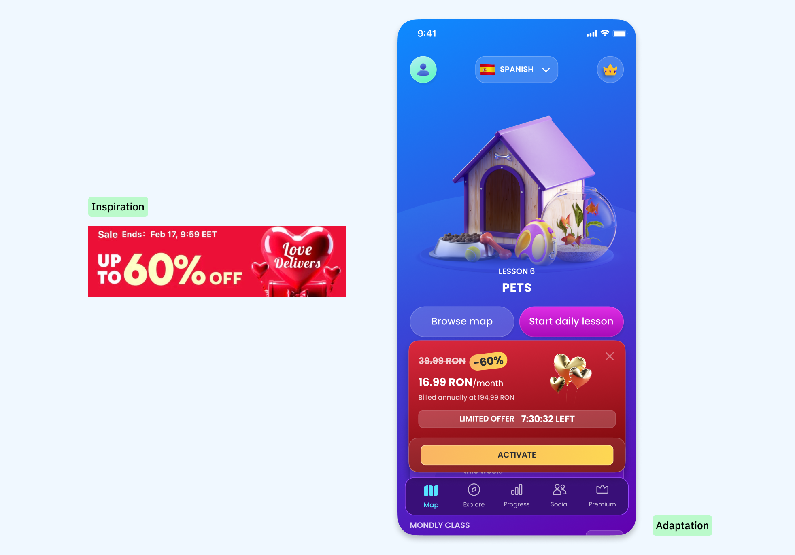
</a>

Translating high-conversion patterns into a solution aligned with Mondly's brand and user experience.

<a href="images/mondly-lto.png" class="lightbox">
  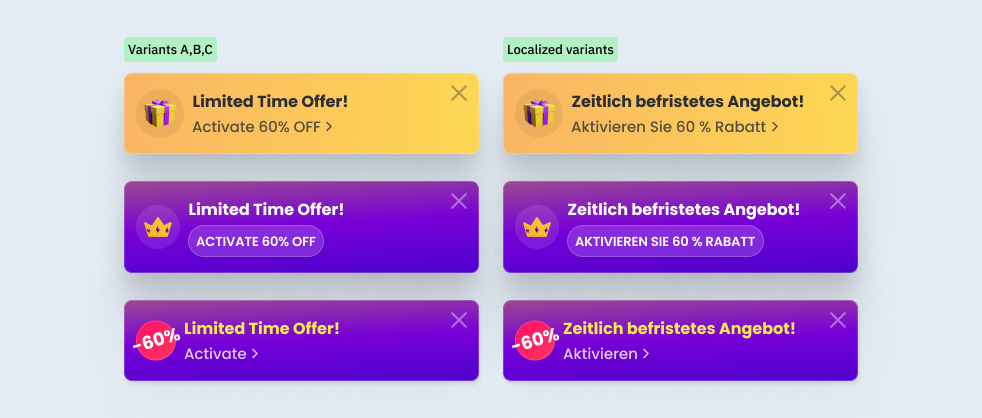
</a>

Preview of the Limited Time Offer Banner variants for testing

#### Seasonal Campaigns

Seasonal campaigns were one of Mondly's **key growth initiatives**, encouraging free users to upgrade to Premium through limited-time offers such as Spring Sale, Valentine's Day and Black Friday.

Our in-app campaigns followed a consistent conversion flow:

<a href="images/seasonal-campaigns-user-flow.png" class="lightbox">
  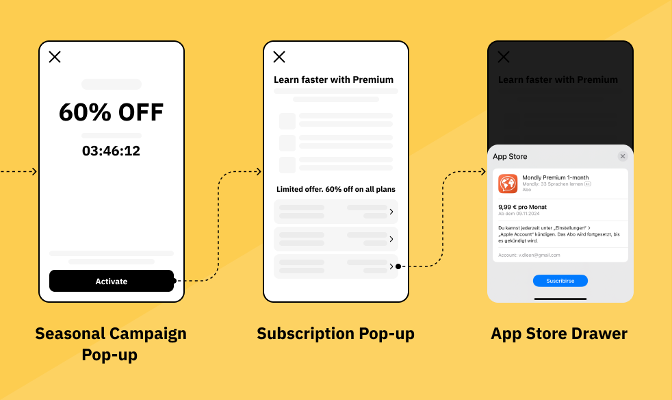
</a>

User conversion through in-app ads flow

##### The Challenge

3D illustrations were a **core part of Mondly's visual identity**. They were used throughout the product to represent courses, learning paths and key features, helping create a distinctive and playful brand experience.

However, seasonal campaigns introduced a different challenge.

Each campaign required a **brand-new illustration created by an external 3D artist**. While the quality was excellent, the process involved **multiple design iterations and stakeholder reviews**, making it difficult to **launch campaigns quickly** and explore different creative directions through experimentation.

As growth initiatives became more frequent, we needed a workflow that could support **faster execution without compromising Mondly's visual identity**.

<a href="images/seasonal-campaigns-old.png" class="lightbox"> 
  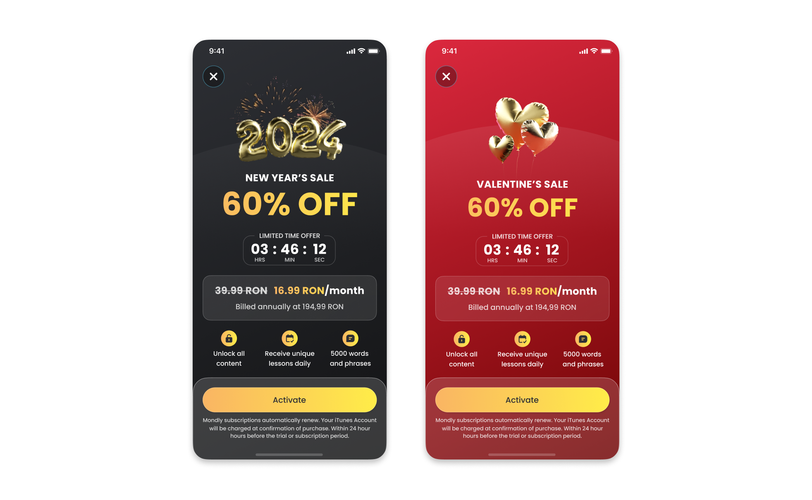 
</a> 

Previous campaign workflow relying on bespoke 3D illustrations created by an external partner.

##### Rethinking the Approach

While discussing the project with another Product Designer, we realised the bottleneck wasn't the campaign layout—it was our **dependency on creating a new 3D illustration for every seasonal promotion**.

Instead of asking "How can we design a better campaign?", we asked:

> **How can we preserve Mondly's visual identity while making seasonal campaigns faster to produce and easier to iterate?**

For the Spring Campaign, I redesigned the promotional layout around **AI-generated imagery** instead of bespoke 3D assets. The goal wasn't to replace Mondly's visual language, but to create a **more scalable campaign system** that maintained the brand while **significantly reducing production time**.

<a href="images/seasonal-campaigns-redesign.png" class="lightbox">
 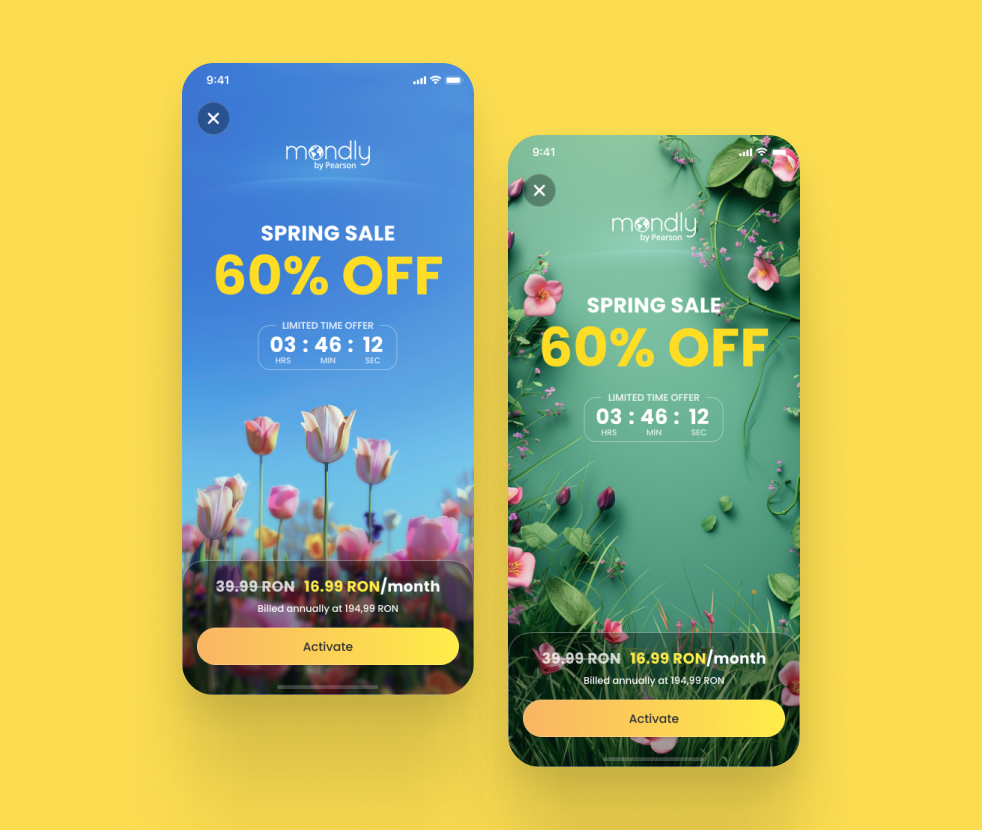 
</a> 

Spring Campaign redesign replacing bespoke 3D artwork with a scalable AI-assisted visual system.

##### Validation

To validate the new approach, we launched **two redesigned variants** alongside the existing campaign and conducted an **A/B/C test**.

<a href="images/seasonal-campaigns-test-result.png" class="lightbox">
 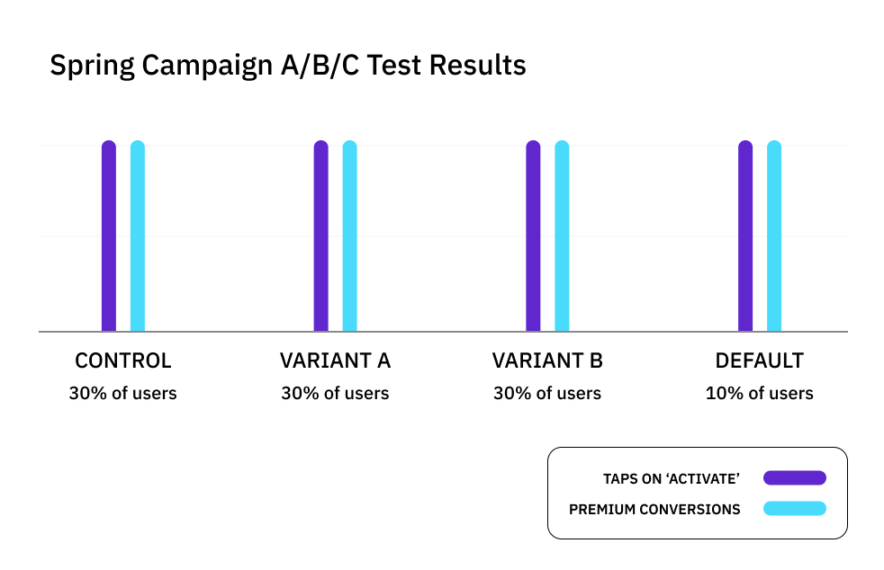 
</a>

 The redesigned campaign generated <strong>7% more <em>Activate</em> taps</strong>, with <strong>Variant B performing best</strong>. Around <strong>2% of users</strong> who reached the Subscription screen continued to the <strong>App Store purchase flow</strong>, moving further down the conversion funnel. 

### Marketing Campaigns

One major ongoing marketing campaign involved creating an onboarding flow with a questionnaire that guided users to a payment screen. I was responsible for the design and UX of this flow. The biggest challenge was developing a style that seamlessly blended elements of both the old and new Mondly branding.

<a href="images/w2w-screens.png" class="lightbox">
  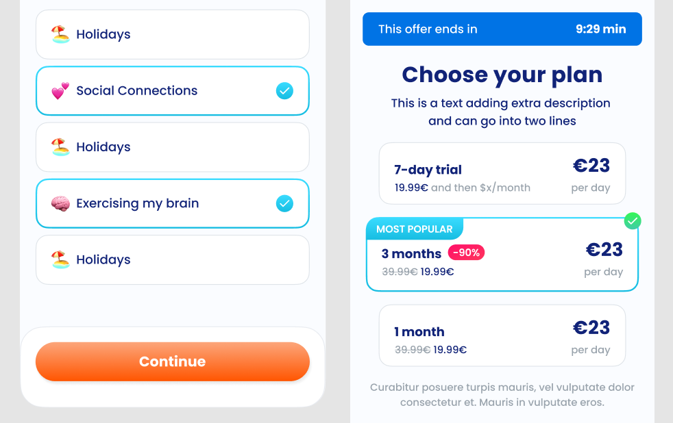
</a>

<a href="images/w2w-components.png" class="lightbox">
  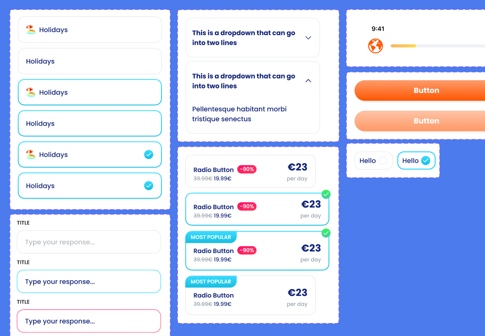
</a>

Figma screenshot from the W2W campaing mockups and components in Figma

