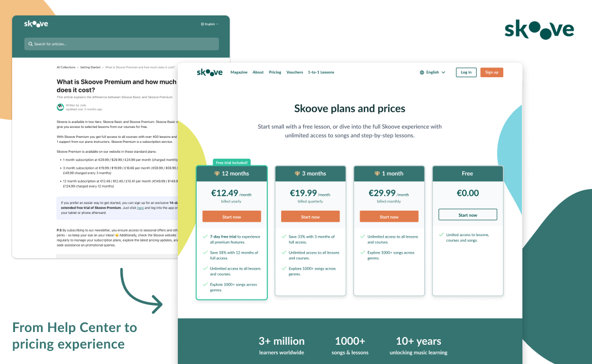
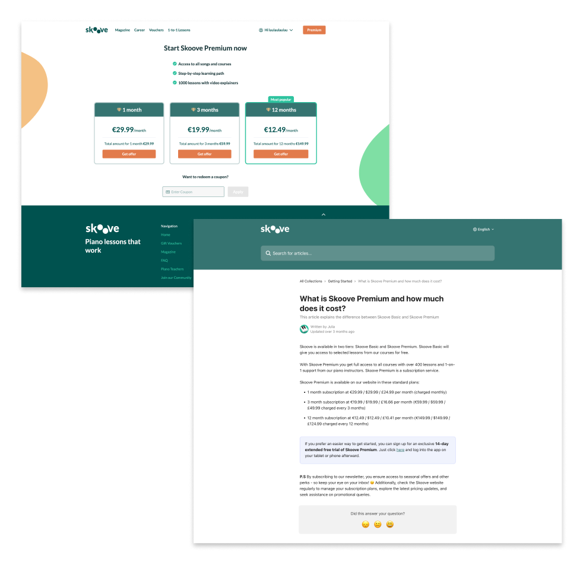
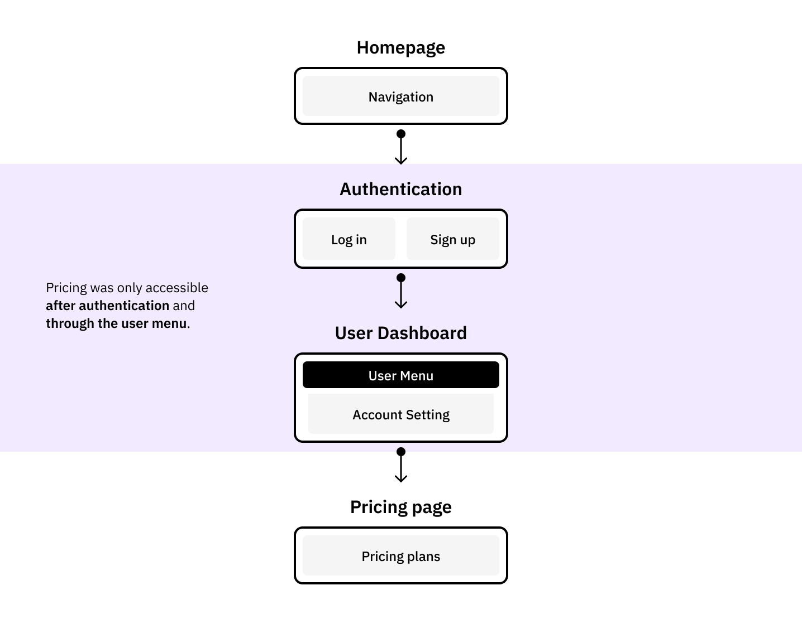
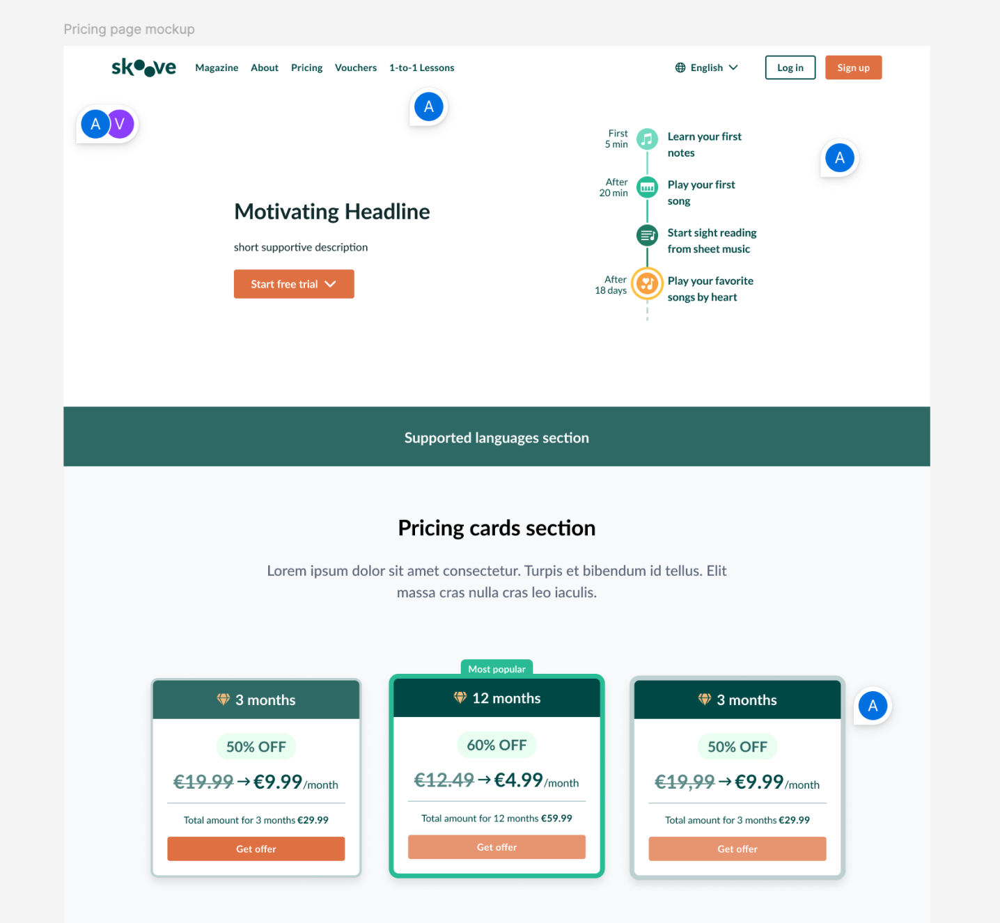
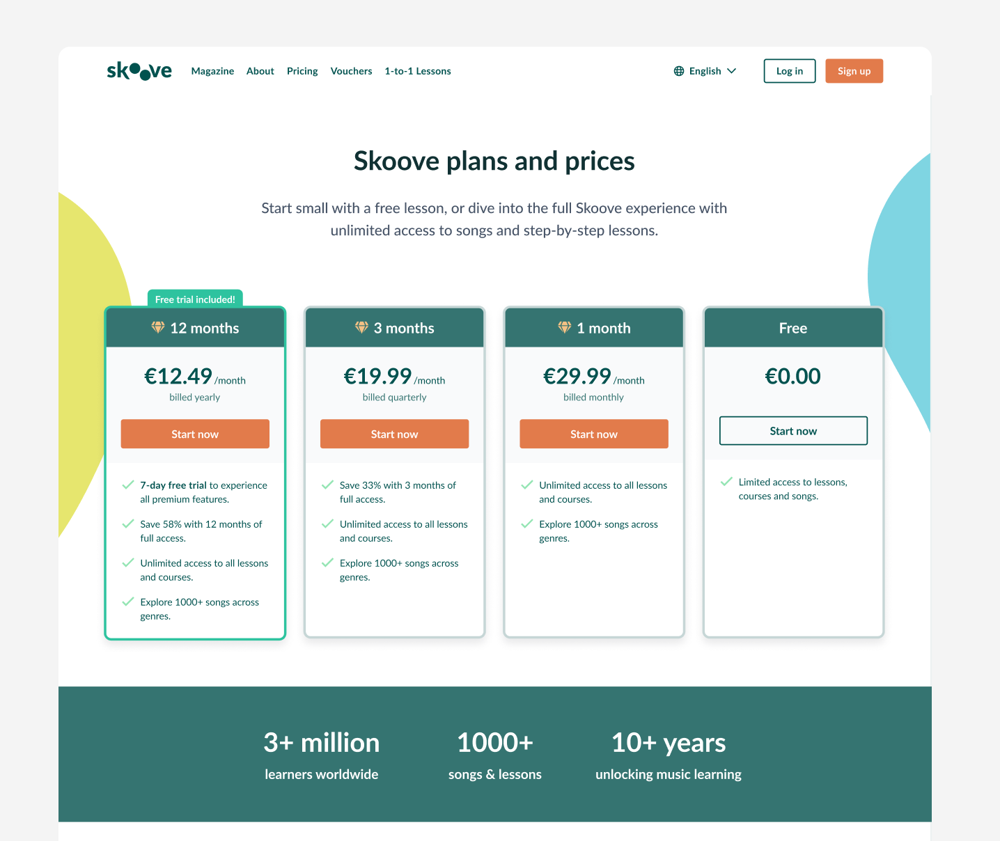
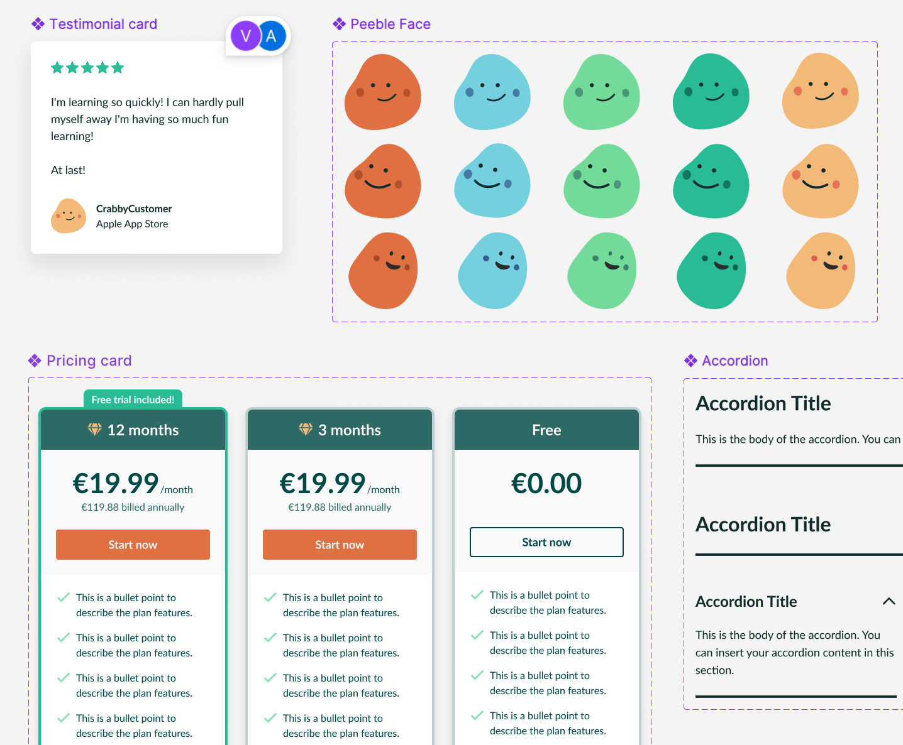
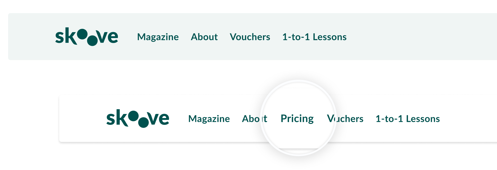

e-learning

Working closely with marketing stakeholders, I helped transform pricing information into a dedicated decision-making experience for future learners, balancing discoverability, content strategy and conversion goals.

  

      
 Senior Product Designer

      
 Freelance Project

      
 2026

  

### Context

As part of a freelance project for Skoove, I worked on designing a dedicated pricing experience for web visitors. At the time, pricing information for **logged-out users** was primarily accessible through a **Help Center article**. While existing customers could view subscription options after signing in, prospective users had limited visibility into plans, pricing and subscription benefits directly on the website.

This created an interesting gap between **discovery** and **decision-making**. Users could find Skoove through search engines, articles and marketing pages, but understanding the value of a subscription often required additional steps before reaching the actual purchase flow.

Side-by-side comparison of the existing pricing page available to logged-in users without a premium subscription and the Help Center pricing article (logged-out experience).

---

<h3>Pricing existed, but the pricing experience didn't</h3>

One of the first things I mapped was the journey for non-premium users. Accessing subscription plans required **creating an account, signing in** and navigating through several screens before reaching the pricing interface.

At the same time, many visitors arriving from Google were landing on a Help Center article listing prices as plain text. The information was technically available, but the experience lacked **context, comparison, trust signals** and clear paths forward.

Current user flow showing how non-premium users navigated from landing page to subscription purchase.

One of the most impactful changes was also one of the simplest: introducing a dedicated <strong>Pricing entry</strong> in the <strong>website navigation</strong>, making subscription information accessible without requiring users to create an account first.

---

### Designing for discovery and decision-making

The goal was not simply to create a pricing page. The page needed to serve multiple purposes at once:

<ul>
  <li>Help visitors understand Skoove's plans and subscription options.</li>
  <li>Communicate value beyond price alone.</li>
  <li>Answer common objections before purchase.</li>
  <li>Improve discoverability through SEO and emerging AI-powered search experiences.</li>
  <li>Create a clearer path from interest to trial.</li>
</ul>

This shifted the project from being a **pricing exercise** into a broader **information architecture challenge**.

---

### A pricing page is more than pricing

Many of the design decisions focused on **reducing uncertainty**.

**Plan comparisons**, **benefit-oriented content**, **social proof** and **FAQs** were introduced to address common questions before they became blockers.

The project also explored how **visual storytelling** could support the messaging. Early concepts for the feature illustrations were developed as part of the design process, helping communicate the learning experience beyond pricing alone. The final artwork was later refined by Skoove's in-house design team.

The page became less about displaying **subscription tiers** and more about helping visitors make an **informed decision**.

Early layout explorations, marketing proposals and annotated design iterations showing how the page structure evolved.

Final pricing page design highlighting plan comparison, benefits, FAQs and conversion-focused sections.

---

### Extending the design system

The project introduced several **new web components** and required updates to existing navigation patterns. These changes were later incorporated into the **Web UI Kit**, helping establish more consistent experiences across marketing and product-related pages.

New components created for the project and later integrated into the Web UI Kit.

---

### Notes

One of the most interesting aspects of this project was seeing how closely content, **discoverability** and **product design** intersect. The challenge wasn't creating a new subscription system, but making an existing one easier to find, understand and trust.

Before-and-after view of the website navigation showing the introduction of the Pricing entry.

Sometimes the challenge is not designing a new feature. It's making an existing experience easier to find, understand and trust.
